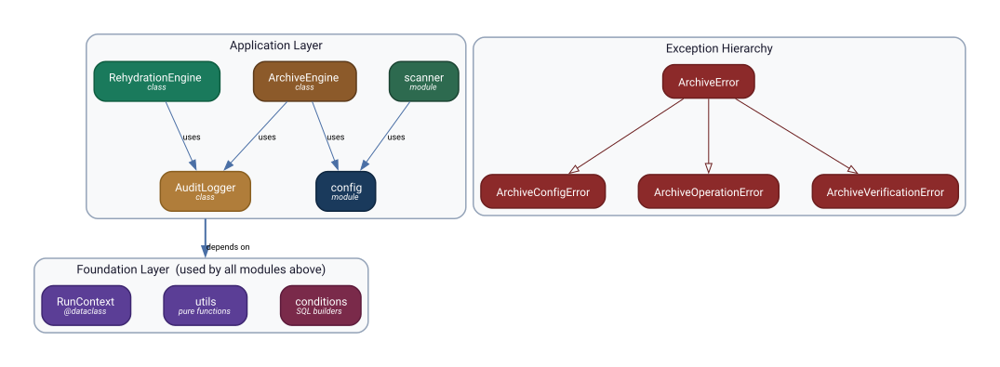
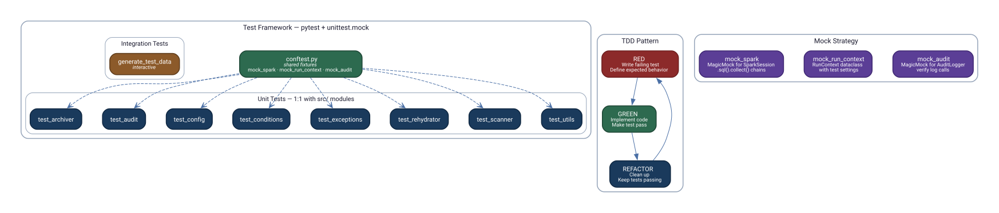

# CareSource Delta Table Archive — Class & Module Diagram

## Module Hierarchy

> Source: [`images/module-hierarchy.dot`](images/module-hierarchy.dot) — regenerate with `dot -Tsvg module-hierarchy.dot -o module-hierarchy.svg`

---

## Test-Driven Development Framework

All production code was developed test-first. Unit tests run locally with **zero Databricks dependencies** — Spark, dbutils, and Delta tables are replaced by `unittest.mock.MagicMock` fixtures.

> Source: [`images/tdd-framework.dot`](images/tdd-framework.dot) — regenerate with `dot -Tsvg tdd-framework.dot -o tdd-framework.svg`

---

## Color Legend

| Color | Meaning |
|-------|---------|
|  **Dark Blue** | Configuration — settings, table configs, schema templates |
|  **Dark Green** | Discovery — scanner, shared fixtures |
|  **Amber** | Core Processing — ArchiveEngine |
|  **Teal** | Rehydration — RehydrationEngine |
|  **Gold** | Audit — AuditLogger |
|  **Purple** | Foundation — RunContext, utils, mocks |
|  **Maroon** | Conditions — exclusion SQL builders |
|  **Red** | Exceptions — error hierarchy |

---

## Key Design Points

| Aspect | Approach |
|--------|----------|
| **Classes** | Only 3: `ArchiveEngine`, `RehydrationEngine`, `AuditLogger` — everything else is functions |
| **Data carrier** | `RunContext` dataclass — settings, secrets, job context in one object |
| **Exception hierarchy** | Single base `ArchiveError` with 3 domain-specific subclasses |
| **Testability** | Constructor injection of `ctx`, `audit`, `spark` — no hidden dependencies |
| **Test isolation** | `MagicMock` replaces Spark entirely — tests run in < 1 second with no cluster |
| **Coverage** | 1:1 test file per source module, 8 test files total |
