# CareSource Delta Table Archive — Design Document

## 1. Architecture Overview

All configuration is stored in Delta tables — no JSON config files. Each environment (workspace) has its own set of config tables with the correct values. The job receives the `global_settings` table name as a parameter, and from there discovers all other config tables via pointer columns.

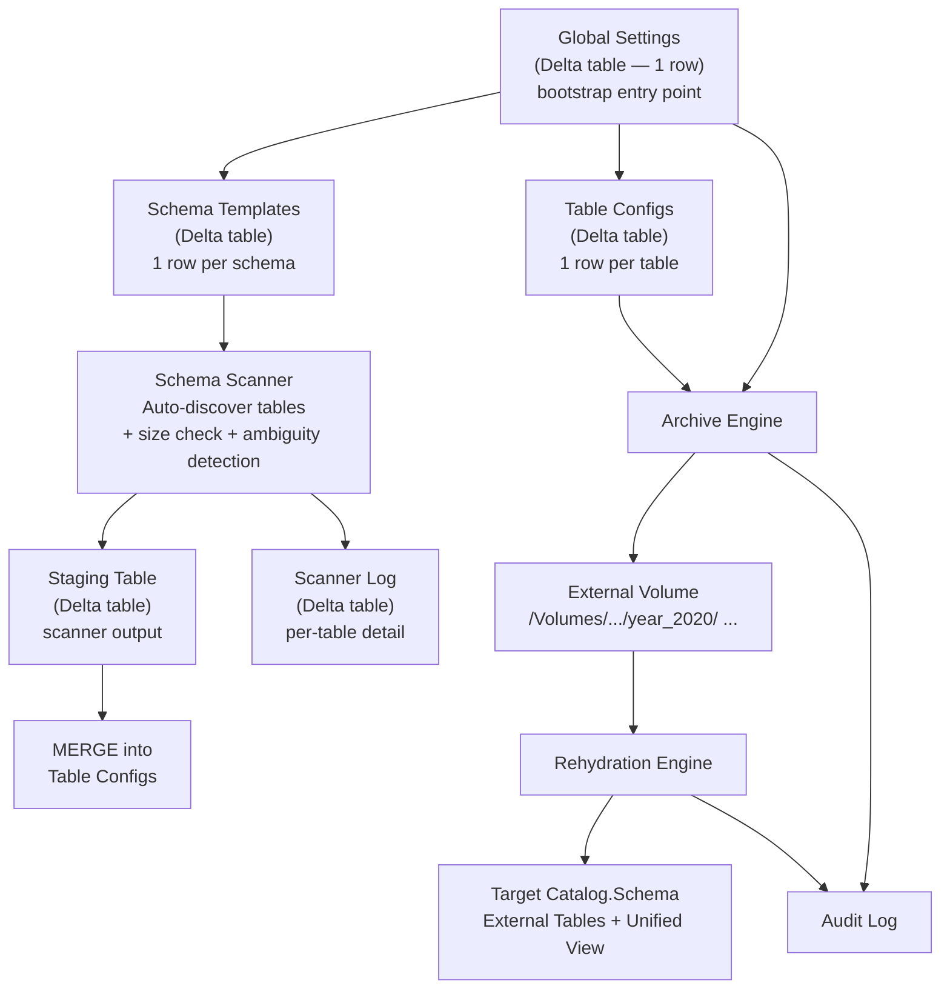

### How the layers connect

| Layer | What it does | Key location |
|-------|-------------|-----------|
| **Global Settings** | Single-row Delta table — audit location, concurrency, dry-run default, secret scope, archive path prefix, and pointers to other config tables. Bootstrap entry point: job receives this table's full name as a parameter | `{config_catalog}.{config_schema}.global_settings` |
| **Schema Templates** | One row per schema in a Delta table — date column patterns, retention defaults, size thresholds, excluded tables. Scanner reads this to discover and onboard tables | `{config_catalog}.{config_schema}.schema_templates` |
| **Table Configs** | One row per table in a Delta table — archive settings including date column, retention, exclusion conditions. Archive job reads this as primary input. Supports optional filter expressions for subset processing | `{config_catalog}.{config_schema}.table_configs` |
| **Table Configs Staging** | Same schema as table configs. Scanner writes discovered tables here, then a MERGE reconciles with the main table configs table | `{config_catalog}.{config_schema}.table_configs_staging` |
| **Schema Scanner** | Discovers tables in Unity Catalog, matches date columns (with ambiguity detection), checks table sizes, writes to staging table, writes per-table detail to `scanner_log` Delta table, then MERGEs staging into final table configs | `src/scanner.py` |
| **Archive Engine** | Reads config, evaluates conditions, writes year folders to storage | `src/archiver.py` |
| **Cloud Storage** | Stores archived data as self-contained Delta External tables per year within Unity Catalog External Volumes | `/Volumes/{catalog}/{schema}/{volume}/` paths only |
| **Rehydration Engine** | Creates zero-copy external tables from archive folders | `src/rehydrator.py` |
| **Target** | Where rehydrated data appears — any catalog/schema the user chooses | Unity Catalog tables + views |
| **Audit** | Logs every archive and rehydrate action with job context | `src/audit.py` |
| **Exceptions** | Custom exception hierarchy for error classification and fail-forward behavior | `src/exceptions.py` |

---

## 2. Class Architecture

Classes own shared state; pure functions handle stateless logic. Classes receive `spark` as a constructor parameter — the only platform dependency they need. Notebooks are the boundary layer: they obtain `spark` and `dbutils` from the platform, extract values from `dbutils` (secrets, job context) into plain dicts via `RunContext`, and pass `spark` + `RunContext` to class constructors. Classes never see `dbutils`. This makes every module unit-testable — mock `spark` in unit tests, use real `spark` on the cluster.

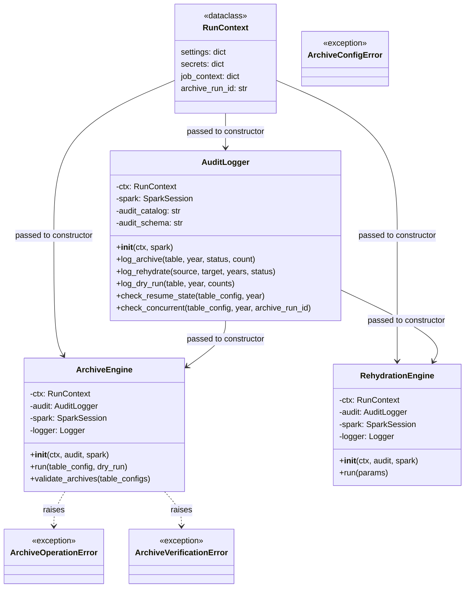

| Class | Purpose |
|-------|---------|
| **RunContext** | Immutable bag of runtime state — settings, secrets, job metadata, and the unique run ID. Built once per notebook invocation and threaded through all constructors. |
| **AuditLogger** | Writes every archive/rehydrate outcome to Delta audit tables. Also handles resume detection (pick up after a crash) and concurrent-run guards. |
| **ArchiveEngine** | Core archive logic: evaluates retention, applies exclusion conditions, writes year folders, verifies counts, and optionally deletes from source. |
| **RehydrationEngine** | Restores archived data on demand — creates zero-copy external tables over archive folders and a unified view combining live + historical data. |
| **ArchiveConfigError** | Raised for invalid configuration (bad operators, missing fields). Stops the job before any data is touched. |
| **ArchiveOperationError** | Raised for runtime failures (storage write errors, Spark exceptions). Fails the current table; other tables continue. |
| **ArchiveVerificationError** | Raised when post-write count verification fails or a concurrent run is detected. Prevents source deletes. |

### Exception hierarchy

Defined in `src/exceptions.py`. All three inherit from a common `ArchiveError` base.

| Exception | Raised when | Job effect |
|-----------|------------|------------|
| `ArchiveConfigError` | Bad config: missing fields, invalid operators, duplicate table_id, broken custom_sql placeholders | Hard stop in `generate_parameters` — no ForEach tasks launch |
| `ArchiveOperationError` | Runtime failure: storage write, Spark error, custom_sql execution error | Current ForEach task fails, other tables continue |
| `ArchiveVerificationError` | Count mismatch after archive write, or concurrent run detected | Aborts delete for that table. Never silenced |

### What stays as pure functions

| Module | Why no class |
|--------|-------------|
| `src/config.py` | Reads Delta config tables, validates, returns dicts. No shared state. |
| `src/conditions.py` | Translates config dicts to SQL strings. Stateless. |
| `src/scanner.py` | Reads Unity Catalog metadata, matches date columns (with ambiguity detection), checks table sizes, writes scanner_log, writes to staging Delta table, MERGEs to final table configs. Supports targeted scan by `schema_id` or all active templates. Stateless. |
| `src/utils.py` | Path helpers, `get_job_context()`, `generate_archive_run_id()`, `configure_logging()`, `load_secrets()`. Standalone. |
| `src/exceptions.py` | Exception class definitions. No logic. |

### How RunContext flows

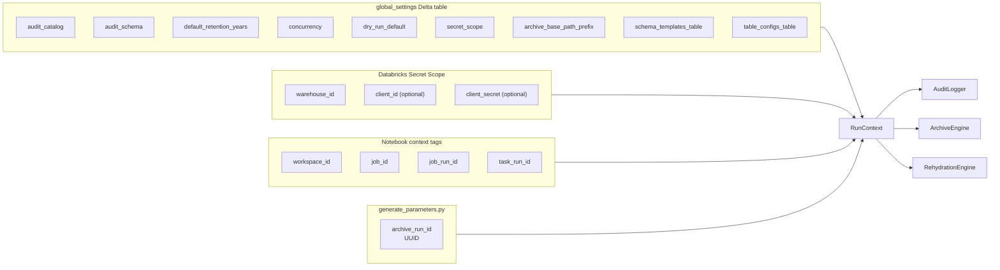

### Notebook wiring

```python
settings = load_settings(spark, config_table)  # reads global_settings Delta table
configure_logging(settings, archive_run_id)
secrets = load_secrets(settings, dbutils)       # reads from secret scope
ctx = RunContext(settings, secrets, get_job_context(dbutils), archive_run_id)
audit = AuditLogger(ctx, spark)
engine = ArchiveEngine(ctx, audit, spark)
engine.run(table_config, dry_run=dry_run)
```

`load_settings()` reads the single-row `global_settings` Delta table specified by the `config_table` job parameter. Returns the row as a dict. The table contains pointers (`schema_templates_table`, `table_configs_table`) that the process uses to discover other config tables.

`load_secrets()` reads the `secret_scope` field from settings, then retrieves warehouse ID and any other runtime credentials via `dbutils.secrets.get()`. Returns a dict of key-value pairs. Keys that don't exist in the scope are silently skipped (optional credentials).

---

## 3. Archive Process Flow

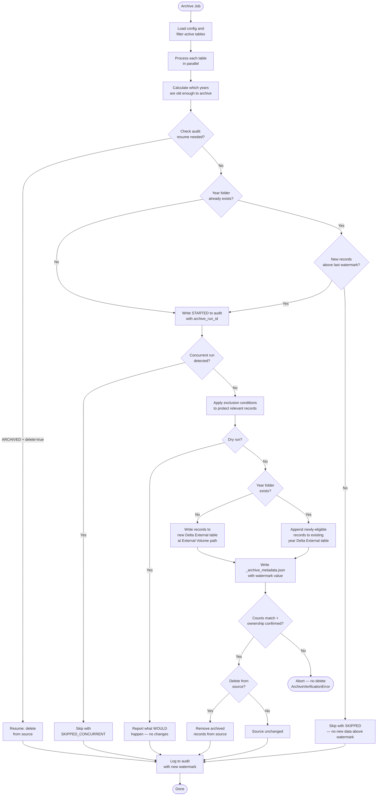

### Incremental archive for existing year folders

When a year folder already exists, the engine uses the watermark recorded in the audit log to determine whether new data exists. The behavior is the same regardless of `delete_after_archive`:

| # | Year folder exists? | New records above watermark? | Behavior |
|---|---|---|---|
| 1 | No | N/A | **CREATE** — write all eligible records as a new Delta External table at the External Volume path |
| 2 | Yes | Yes | **APPEND** — append newly-eligible records to the existing year Delta External table |
| 3 | Yes | No | **SKIP** — no work needed; log `SKIPPED` status |

**No overwrite mode.** Archive folders are append-only by design. If a folder contains incorrect data, the operator manually removes the folder and its audit log entries, then re-runs. There is no `year_override` parameter — providing in-process force overrides is dangerous and creates a footgun.

**Why watermark works for both `delete_after_archive` modes:**
- When `delete_after_archive=true`: source has only leftovers (excluded + NULL watermark). Watermark correctly identifies which of those leftovers are newly-eligible
- When `delete_after_archive=false`: source retains all records. Watermark still correctly identifies records not yet archived (their watermark value is higher than `MAX(watermark_column)` from the last audit row)

**Why not sub-folders?** Sub-folders within year folders (e.g., `year_2018/batch_20260315/`) were considered and rejected:
- Each sub-folder would be a separate Delta table with its own `_delta_log` — an external table can't span multiple Delta tables under one path
- Rehydration would need one external table per batch, then UNION them in the view — significantly more complex
- Delta's native append transaction handles incremental writes cleanly without any structural changes

**Audit logging for appends:** The audit row uses status `ARCHIVED` with `record_count` reflecting only the newly-appended records. The `_archive_metadata.json` includes `"mode": "append"` and the new high-watermark value.

**Rehydration is unaffected.** External tables point to the year folder. Delta reads all transactions — including appends — transparently.

### `_archive_metadata.json` schema

Written alongside each year folder after a successful archive write. Human-readable provenance — no runtime code reads it. Useful for disaster recovery, manual inspection, and long-term traceability after Lakeflow job run records age out of system tables.

```json
{
  "archive_run_id": "a1b2c3d4-e5f6-7890-abcd-ef1234567890",
  "source_catalog": "healthcare",
  "source_schema": "claims",
  "source_table": "member",
  "archive_year": 2020,
  "date_column": "claim_date",
  "retention_years": 5,
  "record_count": 1250000,
  "null_date_count": 37,
  "conditions_applied": ["active_status", "recent_claims"],
  "delete_after_archive": true,
  "mode": "write",
  "watermark_column": "claim_date",
  "last_watermark_value": "2020-12-31T23:59:59.999Z",
  "archived_by": "archive-service-principal",
  "archive_timestamp": "2026-03-30T14:30:22.471Z",
  "workspace_id": "1234567890123456",
  "job_id": "987654321",
  "job_run_id": "11223344",
  "task_run_id": "55667788"
}
```

| Field | Why it's here |
|-------|---------------|
| `archive_run_id` | **Durable correlation key.** Links this folder to audit table rows and other year folders from the same job. Survives after Lakeflow job history ages out of `system.lakeflow.job_run_timeline`. |
| `source_catalog/schema/table` | Identifies the source — needed if the archive path alone is ambiguous or the source table is later renamed/dropped. |
| `archive_year`, `date_column` | Which slice of data and which column determined the partition. |
| `retention_years` | The retention policy at the time of archiving — may change later. |
| `record_count`, `null_date_count` | Cross-check against audit table. `null_date_count` records the excluded NULLs. |
| `conditions_applied` | Which exclusion rules were active. Business rules change over time; this captures the state at archive time. |
| `delete_after_archive` | Whether the source records were (or will be) deleted. |
| `mode` | `"write"` for initial archive, `"append"` for incremental append to an existing year folder (see ARC-12). Distinguishes first-time writes from subsequent appends. |
| `watermark_column` | The column used as the watermark. Informational — useful when diagnosing incremental behavior. |
| `last_watermark_value` | The `MAX(watermark_column)` at the time of this write/append. The next run uses this value to detect new records. |
| `archived_by` | SP application ID or user email — matches `archived_by` in audit table. |
| `archive_timestamp` | ISO 8601 UTC. When the write completed. |
| `workspace_id`, `job_id`, `job_run_id`, `task_run_id` | Databricks job context at the time of archiving. Useful while Lakeflow system tables still have the data; `archive_run_id` takes over as the long-lived key. |

---

## 4. Rehydration Process Flow

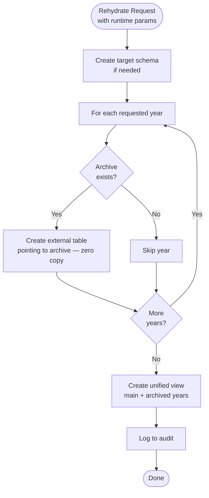

---

## 5. Exclusion Conditions

Business rules in the config get translated to SQL automatically:

| Condition in Config | Generated SQL |
|--------------------|---------------|
| `status_flag equals Active` | `AND NOT (status_flag = 'Active')` |
| Custom SQL: member has recent claims | `AND NOT (EXISTS (SELECT 1 FROM claims ...))` |

If **either** condition matches, the record stays in the source table.

### Supported operators

| Operator | Example |
|----------|---------|
| `equals` | `status = 'Active'` |
| `not_equals` | `status != 'Closed'` |
| `in` | `status IN ('Active', 'Pending')` |
| `within_years` | `last_update within 2 years of today` |
| `within_months` | `last_activity within 6 months` |
| `greater_than` | `balance > 0` |
| `is_not_null` | `active_flag IS NOT NULL` |

---

## 6. Archive Audit Status State Machine

Statuses are enumerated values. `STARTED` enables concurrency detection. `ARCHIVED` enables resumability — if a previous run wrote the archive but crashed before deleting, the next run picks up from there.

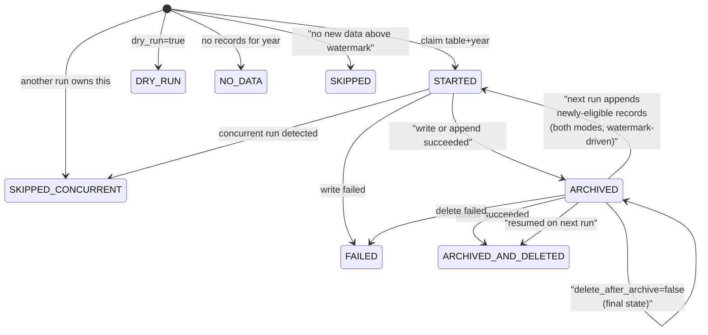

### Archive statuses

| Status | Meaning |
|--------|---------|
| `STARTED` | Archive in progress for this table+year. Used for concurrency detection — contains `archive_run_id`. Applies to both initial writes and incremental appends |
| `DRY_RUN` | Dry-run completed; report generated, no data touched |
| `ARCHIVED` | Records written to archive storage; source unchanged. For incremental appends, `record_count` reflects only the newly-appended records |
| `ARCHIVED_AND_DELETED` | Records written and deleted from source |
| `FAILED` | Operation failed (error_message has details) |
| `SKIPPED` | Year folder exists but no new records above the last watermark — no work needed for this table+year |
| `SKIPPED_CONCURRENT` | Another job run is already processing this table+year |
| `NO_DATA` | No records found for the year |

### Rehydration statuses

| Status | Meaning |
|--------|---------|
| `COMPLETED` | All requested years restored as external tables |
| `PARTIAL_COMPLETED` | Some years restored, some skipped (archive folder missing) |
| `FAILED` | No years restored or hard error (error_message has details) |

---

## 7. Audit Table Schemas

### archive_audit_log

| Column | Type | Source |
|--------|------|--------|
| archive_timestamp | TIMESTAMP | System |
| source_catalog | STRING | Table config |
| source_schema | STRING | Table config |
| source_table | STRING | Table config |
| archive_base_path | STRING | Table config |
| archive_year | INT | Calculated |
| record_count | BIGINT | Query result |
| status | STRING | Enumerated (see Section 6) |
| conditions_applied | STRING | Condition names joined |
| null_date_count | BIGINT | Records with NULL date column (required value error — excluded from archiving) |
| last_watermark_value | STRING | `MAX(watermark_column)` at the time of the archive write or append. Used by the next run to detect new records. NULL for `DRY_RUN`, `SKIPPED`, and `NO_DATA` rows |
| error_message | STRING | Exception text or NULL |
| archived_by | STRING | `current_user()` |
| archive_run_id | STRING | **Durable correlation key.** UUID from generate_parameters — links all audit rows, year folders, and `_archive_metadata.json` from a single job run. Survives after Lakeflow job history ages out |
| workspace_id | STRING | Notebook context tag `orgId` — useful while Lakeflow system tables retain data |
| job_id | STRING | Notebook context tag `jobId` |
| job_run_id | STRING | Notebook context tag `multitaskParentRunId` |
| task_run_id | STRING | Notebook context tag `runId` |

### rehydration_audit_log

| Column | Type | Source |
|--------|------|--------|
| rehydration_timestamp | TIMESTAMP | System |
| archive_base_path | STRING | Runtime param |
| source_catalog | STRING | Runtime param |
| source_schema | STRING | Runtime param |
| source_table | STRING | Runtime param |
| rehydrated_catalog | STRING | Runtime param |
| rehydrated_schema | STRING | Runtime param |
| rehydrated_table_name | STRING | Runtime param |
| years_rehydrated | STRING | Comma-separated |
| external_tables_created | INT | Count |
| status | STRING | Enumerated (see Section 6) |
| error_message | STRING | Exception text or NULL |
| rehydrated_by | STRING | `current_user()` |
| archive_run_id | STRING | **Durable correlation key.** UUID or NULL (rehydration may be ad-hoc). When present, links back to the archive run that produced the data being rehydrated |
| workspace_id | STRING | Notebook context tag `orgId` — useful while Lakeflow system tables retain data |
| job_id | STRING | Notebook context tag `jobId` |
| job_run_id | STRING | Notebook context tag `multitaskParentRunId` |
| task_run_id | STRING | Notebook context tag `runId` |

---

## 8. Data Flow: End to End

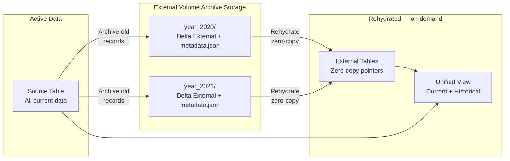

---

## 9. Schema Scanner Flow

Two-stage scan: the scanner writes discovered tables to a staging Delta table (`table_configs_staging`), then a MERGE reconciles staging against the main `table_configs` table to detect manual edits, new tables, and dropped tables. Delta time travel on the staging table provides version history of schema evolution.

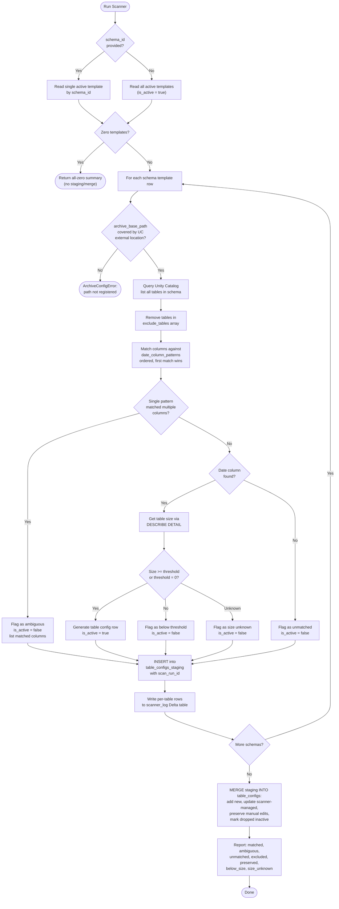

### Archive path validation (SCN-14)

Before scanning tables for a schema, the scanner validates that `archive_base_path` is a Unity Catalog External Volume path (`/Volumes/` prefix) and that the specified volume exists. Direct cloud storage paths (`s3://`, `abfss://`) are rejected. This catches misconfigured or missing storage infrastructure at onboarding time rather than at archive time.

```python
def validate_archive_path(spark, archive_base_path):
    """Validates that archive_base_path is a Unity Catalog External Volume path."""
    normalized = archive_base_path.rstrip("/")
    # Must start with /Volumes/ — direct cloud paths are not supported
    if not normalized.startswith("/Volumes/"):
        raise ArchiveConfigError(
            f"archive_base_path '{archive_base_path}' must be a Unity Catalog External Volume "
            f"path starting with '/Volumes/'. Direct cloud storage paths (s3://, abfss://) are "
            f"not supported. Create an External Volume and update the schema template. "
            f"See: prerequisites.md → Per-Environment Infrastructure"
        )
    # Verify the volume exists and is accessible
    parts = normalized.split("/")  # ['', 'Volumes', catalog, schema, volume, ...]
    if len(parts) < 5:
        raise ArchiveConfigError(
            f"archive_base_path '{archive_base_path}' is not a valid Volume path. "
            f"Expected format: /Volumes/{{catalog}}/{{schema}}/{{volume_name}}/"
        )
    volume_catalog, volume_schema, volume_name = parts[2], parts[3], parts[4]
    volumes = spark.sql(f"SHOW VOLUMES IN {volume_catalog}.{volume_schema}").collect()
    volume_names = [v.volume_name for v in volumes]
    if volume_name not in volume_names:
        raise ArchiveConfigError(
            f"Volume '{volume_name}' not found in {volume_catalog}.{volume_schema}. "
            f"Create the External Volume before running the scanner. "
            f"See: prerequisites.md → Per-Environment Infrastructure"
        )
```

### MERGE logic (default — no force flag)

Manual edit detection via `modified_by` column. Rows where `modified_by = 'scanner'` are scanner-managed and will be updated. Rows where `modified_by` is anything else were manually edited and are preserved.

```sql
MERGE INTO {table_configs_table} AS target
USING (SELECT * FROM {staging_table} WHERE scan_run_id = '{current_scan_run_id}') AS source
ON target.table_id = source.table_id

WHEN NOT MATCHED THEN
  INSERT (table_id, source_catalog, source_schema, source_table,
          date_column, retention_years, archive_base_path, delete_after_archive,
          is_active, reason, exclusion_conditions,
          modified_by, modified_at, change_reason)
  VALUES (source.table_id, source.source_catalog, source.source_schema, source.source_table,
          source.date_column, source.retention_years, source.archive_base_path,
          source.delete_after_archive, source.is_active, source.reason,
          source.exclusion_conditions,
          'scanner', current_timestamp(), CONCAT('added by scan ', '{scan_run_id}'))

WHEN MATCHED AND target.modified_by = 'scanner' THEN
  UPDATE SET target.date_column = source.date_column,
             target.is_active = source.is_active,
             target.reason = source.reason,
             target.modified_at = current_timestamp(),
             target.change_reason = CONCAT('updated by scan ', '{scan_run_id}');

-- Tables in target but not in staging (dropped) are handled separately:
UPDATE {table_configs_table}
SET    is_active = false,
       reason = CONCAT('dropped: not found in scan ', '{scan_run_id}', ' at ', current_timestamp()),
       modified_at = current_timestamp(),
       change_reason = CONCAT('marked inactive by scan ', '{scan_run_id}')
WHERE  modified_by = 'scanner'
  AND  table_id NOT IN (SELECT table_id FROM {staging_table} WHERE scan_run_id = '{current_scan_run_id}');
```

| Scenario | Behavior |
|---|---|
| Table in staging, not in table_configs | INSERT as new row, `modified_by = 'scanner'` |
| Table in both, `modified_by = 'scanner'` | UPDATE from staging (re-evaluated size, date column) |
| Table in both, `modified_by != 'scanner'` | Preserve — manual edits are not overwritten |
| Table in table_configs only, `modified_by = 'scanner'` | Set `is_active = false`, reason notes the scan timestamp |
| Table in table_configs only, `modified_by != 'scanner'` | Preserve unchanged — manually managed tables are not dropped |

### Ambiguous date column handling

When a single pattern matches more than one column in a table, the scanner flags the table as ambiguous rather than guessing:

```python
def match_date_column(table_columns, patterns):
    for pattern in patterns:
        matched = [col for col in table_columns
                   if col == pattern or re.fullmatch(pattern, col)]
        if len(matched) == 1:
            return matched[0], pattern, matched, "matched"
        if len(matched) > 1:
            return None, pattern, matched, "ambiguous"
    return None, None, [], "unmatched"
```

| Match result | `is_active` | `reason` | Example |
|---|---|---|---|
| Exactly one column matches a pattern | `true` | — | `claim_date` matches `"claim_date"` |
| Multiple columns match the same pattern | `false` | `"ambiguous date column: pattern '.*_date$' matched [start_date, end_date, review_date]"` | Catch-all regex hits 3 columns |
| No pattern matches any column | `false` | `"no date column found matching patterns [...]"` | Table has no date-like columns |

**Resolution:** The operator adds a specific exact-name pattern earlier in the `date_column_patterns` array (e.g., `"start_date"` before `".*_date$"`), or manually sets `date_column` in the table config row (preserved by MERGE logic since `modified_by` will differ from `'scanner'`).

### Scanner log table (`scanner_log`)

Every scanner run writes per-table detail rows to a Delta table — separate from the archive audit tables. This is a diagnostic/analysis table: no runtime code reads it. Operators can query it via SQL, join across scan runs, or export to CSV/Excel.

Location uses the same catalog/schema as audit tables (from `global_settings`).

| Column | Type | Source |
|--------|------|--------|
| scan_run_id | STRING | UUID generated per scanner invocation |
| scan_timestamp | TIMESTAMP | System |
| source_catalog | STRING | Schema template |
| source_schema | STRING | Schema template |
| source_table | STRING | Discovered table |
| table_columns | STRING | All columns as JSON array (from UC metadata) |
| date_column_patterns | STRING | Patterns evaluated, as JSON array (from template) |
| matched_pattern | STRING | Pattern that produced the winning match, or NULL |
| matched_column | STRING | Resolved date column, or NULL |
| all_matched_columns | STRING | JSON array of all columns that matched any pattern — shows ambiguity even when resolved |
| match_status | STRING | `matched` / `ambiguous` / `unmatched` / `excluded` |
| ambiguity_detail | STRING | e.g. `"pattern '.*_date$' matched [start_date, end_date]"`, or NULL |
| table_size_gb | DOUBLE | From `DESCRIBE DETAIL`, or NULL if unavailable |
| size_status | STRING | `above_threshold` / `below_threshold` / `unknown` |
| min_table_size_gb | DOUBLE | Threshold used (from template) |
| is_active | BOOLEAN | Final active flag for this table |
| reason | STRING | Reason when `is_active = false`, or NULL |
| merge_action | STRING | `added` / `updated` / `preserved` / `dropped` / NULL (staging-only) |
| scanned_by | STRING | `current_user()` |
| workspace_id | STRING | Notebook context tag `orgId` |

**Useful queries:**

```sql
-- Find all ambiguous tables across the latest scan
SELECT source_catalog, source_schema, source_table,
       ambiguity_detail, all_matched_columns
FROM   {audit_catalog}.{audit_schema}.scanner_log
WHERE  match_status = 'ambiguous'
  AND  scan_run_id = (SELECT MAX(scan_run_id) FROM scanner_log);

-- Track pattern effectiveness over time
SELECT scan_timestamp, matched_pattern,
       COUNT(*) AS tables_matched
FROM   {audit_catalog}.{audit_schema}.scanner_log
WHERE  match_status = 'matched'
GROUP BY scan_timestamp, matched_pattern
ORDER BY scan_timestamp DESC;

-- Export for Excel analysis
SELECT * FROM {audit_catalog}.{audit_schema}.scanner_log
WHERE  scan_run_id = '{run_id}'
ORDER BY source_catalog, source_schema, source_table;
```

---

## 10. Configuration — Delta Tables

All configuration is stored in Delta tables within the target environment's Unity Catalog. There are no JSON config files and no environment overlay mechanism. Each workspace has its own config tables with the correct values for that environment.

### Bootstrap flow

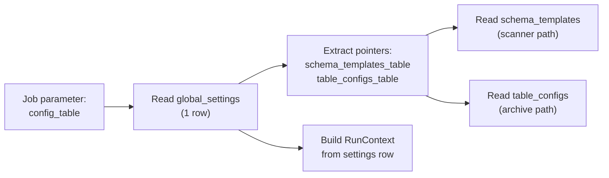

The job receives one parameter: `config_table` — the full three-level name of the `global_settings` Delta table (e.g., `archive_config.config.global_settings`). That single-row table contains pointers to all other config tables. The config table location IS the environment — no overlay or merge logic needed.

### Config table schemas

See `notebooks/setup_config_tables.py` for full CREATE TABLE statements.

#### `global_settings` (1 row — bootstrap entry point)

| Column | Type | Description |
|--------|------|-------------|
| `audit_catalog` | STRING NOT NULL | Unity Catalog for audit tables |
| `audit_schema` | STRING NOT NULL | Schema for audit tables |
| `default_retention_years` | INT NOT NULL | Default retention when table config omits it |
| `concurrency` | INT NOT NULL | Parallelism for ForEach tasks |
| `dry_run_default` | BOOLEAN NOT NULL | Default dry-run flag |
| `timezone` | STRING NOT NULL | Spark session timezone for date comparisons |
| `secret_scope` | STRING NOT NULL | Databricks secret scope name |
| `schema_templates_table` | STRING NOT NULL | Pointer: full 3-level name of schema_templates table |
| `table_configs_table` | STRING NOT NULL | Pointer: full 3-level name of table_configs table |
| `archive_base_path_prefix` | STRING NOT NULL | Cloud storage prefix for this environment |
| `modified_by` | STRING NOT NULL | Who last changed this row |
| `modified_at` | TIMESTAMP NOT NULL | When last changed |
| `change_reason` | STRING | Why it was changed |

#### `schema_templates` (1 row per schema)

| Column | Type | Description |
|--------|------|-------------|
| `schema_id` | STRING NOT NULL | PK — human-readable identifier (e.g. `claims`, `members`) |
| `source_catalog` | STRING NOT NULL | Unique with `source_schema` (enforced in code) |
| `source_schema` | STRING NOT NULL | Unique with `source_catalog` (enforced in code) |
| `date_column_patterns` | ARRAY&lt;STRING&gt; NOT NULL | Ordered list of regex patterns for date column matching |
| `default_retention_years` | INT NOT NULL | Default retention for tables in this schema |
| `archive_base_path` | STRING NOT NULL | Base archive path for this schema — must be a Unity Catalog External Volume path (`/Volumes/{catalog}/{schema}/{volume_name}/`) |
| `delete_after_archive` | BOOLEAN NOT NULL | Default delete behavior |
| `min_table_size_gb` | DOUBLE NOT NULL | Minimum size threshold (0 = no filtering) |
| `exclude_tables` | ARRAY&lt;STRING&gt; | Table names to skip during scanning |
| `description` | STRING | Human-readable description |
| `is_active` | BOOLEAN NOT NULL | Whether to include in scanner runs |
| `modified_by` | STRING NOT NULL | Audit |
| `modified_at` | TIMESTAMP NOT NULL | Audit |
| `change_reason` | STRING | Audit |

#### `table_configs` (1 row per table)

| Column | Type | Description |
|--------|------|-------------|
| `table_id` | STRING NOT NULL | PK — `"catalog.schema.table"` |
| `source_catalog` | STRING NOT NULL | Unity Catalog catalog |
| `source_schema` | STRING NOT NULL | Unity Catalog schema |
| `source_table` | STRING NOT NULL | Table name |
| `date_column` | STRING NOT NULL | Resolved date column for retention |
| `retention_years` | INT | NULL = inherit from `global_settings.default_retention_years` |
| `archive_base_path` | STRING NOT NULL | Full archive path for this table — must be a Unity Catalog External Volume path (`/Volumes/{catalog}/{schema}/{volume_name}/{table_name}/`) |
| `delete_after_archive` | BOOLEAN NOT NULL | Whether to delete after successful archive |
| `is_active` | BOOLEAN NOT NULL | Include in archive runs |
| `reason` | STRING | Why inactive (scanner or manual) |
| `exclusion_conditions` | ARRAY&lt;STRUCT&lt;name STRING, scope STRING, column STRING, operator STRING, value STRING, sql STRING&gt;&gt; | Business rules — see Section 5 |
| `modified_by` | STRING NOT NULL | Audit — `'scanner'` for auto-managed rows |
| `modified_at` | TIMESTAMP NOT NULL | Audit |
| `change_reason` | STRING | Audit |

#### `table_configs_staging` (scanner output)

Same schema as `table_configs` minus audit columns, plus `scan_run_id STRING` and `scan_timestamp TIMESTAMP`. Scanner writes here; MERGE reconciles with `table_configs`. Delta time travel on this table provides version history of scanned results.

### Setup job — creating config tables

DABs does not support declarative table creation, so a setup notebook + job handles this. Run once per environment to create the config Delta tables and optionally seed initial data.

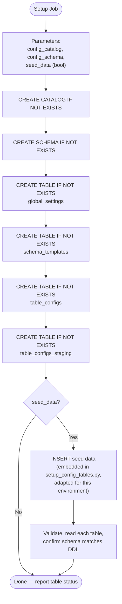

**Notebook:** `notebooks/setup_config_tables.py`

**Parameters:**

| Parameter | Required | Description |
|-----------|----------|-------------|
| `config_catalog` | Yes | Unity Catalog catalog for config tables |
| `config_schema` | Yes | Schema within the catalog |
| `seed_data` | No (default: false) | Whether to INSERT sample data after creating tables |

**DABs job:** `resources/setup_job.yml` — single-task job with `setup_config_tables.py`. Targets per environment. Run once per environment during initial setup, or when schema changes require table recreation.

**Idempotent:** Uses `CREATE TABLE IF NOT EXISTS` — safe to re-run. Seed data only inserts if the table is empty (avoids duplicates).

### Change tracking

Two layers:

- **Audit columns**: Every config table has `modified_by`, `modified_at`, `change_reason`. Tracks who changed what and why.
- **Delta time travel**: Built-in versioned history. Query any previous state via `VERSION AS OF` or `TIMESTAMP AS OF`. Provides rollback capability.

### Secret scopes for runtime credentials

Sensitive and workspace-specific values are stored in Databricks secret scopes — **not** in config tables. The `global_settings` table includes a `secret_scope` field pointing to the scope for this environment.

**What goes in secret scopes:**

| Key | Description | Example |
|-----|-------------|---------|
| `warehouse_id` | SQL warehouse ID for this workspace | `abc123def456` |
| `client_id` | SP OAuth client ID (if needed at runtime for SDK calls) | `00000000-0000-...` |
| `client_secret` | SP OAuth client secret (if needed at runtime for SDK calls) | `dose...` |

**What stays in config tables (non-sensitive):**

Catalog names, schema names, archive paths, retention years, date columns, exclusion conditions, timezone.

**Accessing secrets at runtime:**

```python
scope = settings["secret_scope"]
warehouse_id = dbutils.secrets.get(scope=scope, key="warehouse_id")
```

**Per-environment scope naming convention:** `archive-{env}` (e.g., `archive-dev`, `archive-qa`, `archive-stage`, `archive-prod`).

**ACLs:** The service principal for each environment gets `READ` permission on that environment's scope. Secret scope creation, population, and ACL grants are handled by the CareSource platform team (out of scope for this project).

### Service principal per environment

In QA, Stage, and Prod, jobs run as a service principal configured via `run_as` in the DABs target. Dev runs as the user's identity for interactive testing.

### M2M OAuth for CI/CD deployment

CI/CD pipelines authenticate to higher-environment workspaces using OAuth M2M. The service principal's `client_id` and `client_secret` are stored in CI pipeline secrets (e.g., GitHub Actions secrets, Azure DevOps variable groups) — never in the repository.

```yaml
# In databricks.yml (DABs bundle)
targets:
  dev:
    default: true
    mode: development
    workspace:
      host: https://dev.cloud.databricks.com
    # No run_as — runs as deploying user

  qa:
    mode: production
    workspace:
      host: https://qa.cloud.databricks.com
    run_as:
      service_principal_name: "archive-service-principal"

  prod:
    mode: production
    workspace:
      host: https://prod.cloud.databricks.com
    run_as:
      service_principal_name: "archive-service-principal"
```

**CI/CD auth via environment variables (set in pipeline):**

```bash
export DATABRICKS_HOST="https://prod.cloud.databricks.com"
export DATABRICKS_CLIENT_ID="$SP_CLIENT_ID"       # from CI secrets
export DATABRICKS_CLIENT_SECRET="$SP_CLIENT_SECRET" # from CI secrets

databricks bundle deploy -t prod
```

Alternatively, the CI pipeline can use a `.databrickscfg` profile:

```ini
[prod-deploy]
host          = https://prod.cloud.databricks.com
client_id     = <from-ci-secrets>
client_secret = <from-ci-secrets>
```

The SP needs these Unity Catalog grants (provisioned outside this project):

| Permission | On what | Why |
|-----------|---------|-----|
| `USE CATALOG`, `USE SCHEMA` | Source catalogs/schemas | Read source tables |
| `SELECT`, `MODIFY` | Source tables | Read records, delete archived records |
| `USE CATALOG`, `USE SCHEMA`, `CREATE TABLE` | Audit catalog/schema | Write audit logs |
| `SELECT` | Config catalog/schema | Read config Delta tables |
| `MODIFY` | Config tables (scanner only) | Scanner writes to staging and merges to table_configs |
| `WRITE FILES` | Archive storage paths | Write year folders |
| `CREATE TABLE`, `CREATE VIEW` | Rehydration target catalogs | Create external tables and unified views |
| `READ` (secret scope ACL) | `archive-{env}` secret scope | Read warehouse ID and credentials at runtime |

`current_user()` returns the SP application ID when running as SP, or user email when interactive — both are stored in `archived_by` / `rehydrated_by` with no code changes needed.

---

## 11. CI/CD Pipeline

Three stages. Unit tests run without Databricks (fast, free). Config validation happens at runtime against Delta tables (schema enforced by Delta's type system). Same bundle promotes through environments. Higher-environment deploys authenticate via M2M OAuth (service principal `client_id` / `client_secret` from CI secrets).

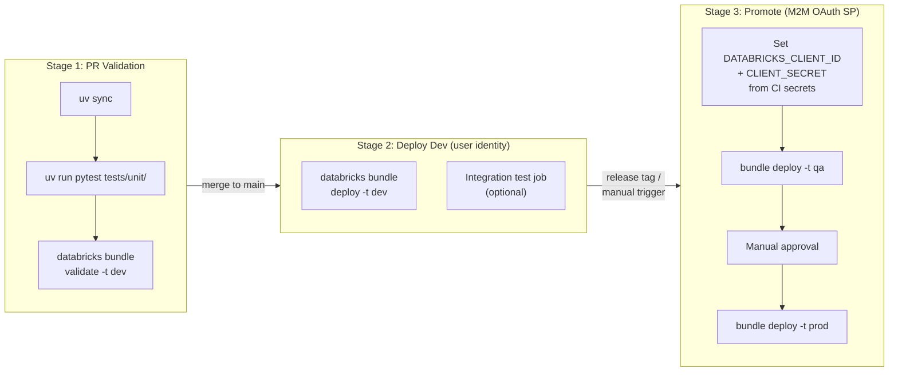

Note: The previous JSON config validation step in Stage 1 is no longer needed — configuration lives in Delta tables with schema enforcement. Config validation now happens at runtime when `load_settings()` reads the `global_settings` table and validates required fields.

---

## 12. Application Logging

Standard Python `logging` module — separate from audit tables. Audit captures outcomes; logging captures diagnostic detail for troubleshooting.

### Logger hierarchy

| Logger name | Module | Used for |
|------------|--------|----------|
| `caresource_archive.config` | `src/config.py` | Config table reads, validation results |
| `caresource_archive.conditions` | `src/conditions.py` | Generated SQL fragments |
| `caresource_archive.archiver` | `src/archiver.py` | Year processing, skip reasons, counts |
| `caresource_archive.rehydrator` | `src/rehydrator.py` | External table creation, view creation |
| `caresource_archive.audit` | `src/audit.py` | Audit writes, resume state checks |
| `caresource_archive.scanner` | `src/scanner.py` | Table discovery, pattern matching, ambiguity detection, scanner_log writes |

### Log format

```
[{timestamp}] [{level}] [{archive_run_id}] [{table}] {message}
```

### Log levels

| Level | When to use | Example |
|-------|------------|---------|
| `DEBUG` | SQL generation, config merge steps, path calculations | `Generated WHERE clause: AND NOT (status = 'Active')` |
| `INFO` | Table/year being processed, skip reasons, completion | `Archiving year 2020 for healthcare.claims.member` |
| `WARNING` | Empty custom_sql results, unusual counts | `custom_sql condition 'recent_claims' returned 0 exclusions` |
| `ERROR` | NULL date records found (required value missing), operation failures with exception details | `1,200 records with NULL claim_date — required value missing, records excluded from archiving` |
| `ERROR` | Operation failures with exception details | `Archive failed for healthcare.claims.member year 2020: StorageException` |

### Where logs go

On Databricks, Python logs go to the driver log — visible in the job run output. If `system.compute.driver_logs` is enabled on the workspace, logs are queryable via SQL.

---

## 13. Error Handling Pattern

Each ForEach task wraps its work with a consistent try/except pattern:

```python
try:
    audit.log_archive(table, year, status="STARTED", ...)
    engine.run(table_config, dry_run=dry_run)
except ArchiveConfigError:
    raise  # should not happen in ForEach (caught in generate_parameters)
except (ArchiveOperationError, ArchiveVerificationError) as e:
    audit.log_archive(table, year, status="FAILED", error_message=str(e))
    raise  # DABs marks this task failed, other tasks continue
```

### custom_sql error handling

```python
try:
    spark.sql(resolved_sql)
except Exception as e:
    raise ArchiveOperationError(
        f"custom_sql condition '{condition_name}' failed for "
        f"{table_id} year {year}: {e}\nSQL: {resolved_sql}"
    ) from e
```

---

## 14. Rollback and Recovery

No separate rollback mechanism. Safety is layered:

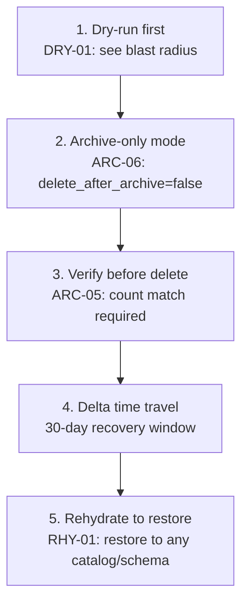

| Layer | What it does | When to use |
|-------|------------|-------------|
| Dry-run | See what would happen without touching data | Before every production run |
| Archive-only | Archive without deleting — data exists in both places | First few cycles for new tables |
| Verify-before-delete | Abort delete if counts don't match | Every delete (automatic) |
| Delta time travel | `VERSION AS OF` recovers deleted records | Emergency — within 30 days of delete |
| Rehydrate | Restore archived data to any location | When historical data is needed again |

---

## 15. Testing Strategy — Requirements First

Tests are written **before** implementation code, derived from the requirements document (not from the implementation). This is the single most important development practice for this project.

### Why requirements-first

If tests are written after seeing the implementation, they unconsciously verify what the code *does* rather than what it *should* do. The implementation becomes its own spec, and bugs hide behind tests that mirror the code's behavior. Writing tests from requirements first means:

- Tests encode the **intended behavior** from requirements.md Section 2
- Every test traces to a requirement ID (CFG-*, ARC-*, EXC-*, DRY-*, RHY-*, AUD-*, SCN-*, ERR-*, EDGE-*, CONC-*, LOG-*, ROLL-*)
- Failing tests on first run confirm the test is actually testing something
- The implementation is written to satisfy the tests, not the other way around

### Per-module workflow

```
1. Read requirements → 2. Write tests → 3. Tests fail → 4. Write code → 5. Tests pass
```

### Test categories

Unit tests cover all modules — pure functions directly, classes with mocked `spark`. Integration tests validate end-to-end behavior through notebooks on a real cluster.

| Category | Tests From | Unit (mocked) | Integration (cluster) | Example |
|----------|-----------|:---:|:---:|---------|
| Config validation | CFG-01 through CFG-09 | Yes (mock `spark` for table reads) | — | Invalid operator rejected with clear error; Delta table read and validation |
| Condition SQL | EXC-01 through EXC-05 | Yes (no mocks) | — | `within_years` generates correct date comparison |
| Exceptions | ERR-01 through ERR-04 | Yes (no mocks) | — | Exception hierarchy, structured error messages |
| Utils | — | Yes (mock `dbutils` for `get_job_context`, `load_secrets`) | — | Path helpers, ID generation, logging config |
| Scanner logic | SCN-01 through SCN-13, CFG-10 | Yes (mock `spark` for UC queries) | Yes | Pattern matching, size threshold, merge/diff logic; real UC scan on cluster |
| Archive engine | ARC-01 through ARC-11, DRY-01 through DRY-05, CONC-01 through CONC-04, EDGE-01 | Yes (mock `spark`) | Yes | Resume deletes, concurrency detection, NULL date handling; real Delta on cluster |
| Rehydration | RHY-01 through RHY-06, ROLL-01 | Yes (mock `spark`) | Yes | External table creation SQL, view SQL; real external tables on cluster |
| Audit logging | AUD-01 through AUD-08 | Yes (mock `spark`) | Yes | Status transitions, archive_run_id; real Delta audit table on cluster |
| Application logging | LOG-01 through LOG-05 | Yes (no mocks) | — | Logger hierarchy follows `caresource_archive.{module}`, structured format includes run_id |
| Rollback/recovery | ROLL-01 | — | Yes | Rehydrate-as-rollback via rehydration tests. ROLL-02 through ROLL-04 are documented procedures — validated via runbook, not automated tests |
| Job orchestration | JOB-01 through JOB-04 | — | — | Validated via `databricks bundle validate` and end-to-end interactive testing. Not unit-tested |

---

## 16. Project Structure

Configuration is stored in Delta tables (not in the repository). The `docs/` directory includes DDL and seed SQL for creating and populating the config tables in each environment.

```
CareSourceArchive/
├── pyproject.toml                # Package metadata, build config, pytest config
├── .python-version               # Pin Python version for local dev and CI
├── uv.lock                       # Locked dependency versions (uv)
├── src/
│   ├── __init__.py
│   ├── exceptions.py             # ArchiveConfigError, ArchiveOperationError, ArchiveVerificationError
│   ├── config.py                 # Pure functions: read Delta config tables, validate, return dicts
│   ├── scanner.py                # Pure functions: scan UC, write staging, MERGE to table_configs
│   ├── conditions.py             # Pure functions: build SQL WHERE clauses
│   ├── archiver.py               # ArchiveEngine class: archive + dry-run + health check
│   ├── rehydrator.py             # RehydrationEngine class: external tables + views
│   ├── audit.py                  # AuditLogger class: all audit logging + concurrency check
│   └── utils.py                  # RunContext dataclass + standalone helpers + configure_logging()
├── notebooks/
│   ├── setup_config_tables.py    # One-time: create config Delta tables + optional seed data
│   ├── generate_parameters.py    # Config → ForEach task values + archive_run_id
│   ├── run_archive.py            # Thin wrapper → ArchiveEngine
│   ├── run_rehydrate.py          # Thin wrapper → RehydrationEngine
│   ├── run_scanner.py            # Thin wrapper → scanner functions
│   ├── validate_config.py        # Validate config Delta tables
│   └── validate_archives.py      # Health check: verify archive folders exist
├── tests/
│   ├── conftest.py              # Shared fixtures: mock_spark, mock_run_context, mock_audit
│   ├── unit/                    # Runs locally with uv run pytest — mocked spark for classes
│   │   ├── test_utils.py
│   │   ├── test_config.py
│   │   ├── test_conditions.py
│   │   ├── test_exceptions.py
│   │   ├── test_scanner.py
│   │   ├── test_archiver.py       # ArchiveEngine with mocked spark
│   │   ├── test_rehydrator.py     # RehydrationEngine with mocked spark
│   │   └── test_audit.py          # AuditLogger with mocked spark
│   ├── integration/             # End-to-end through notebooks — requires Spark + cluster
│   │   ├── test_archive_flow.py
│   │   ├── test_rehydrate_flow.py
│   │   └── test_audit_flow.py
│   └── interactive/             # Manual ad-hoc scripts, not CI
│       ├── try_config_load.py
│       ├── try_archive_single_table.py
│       ├── try_rehydrate.py
│       └── try_scanner.py
├── resources/
│   ├── archive_job.yml           # DABs job definitions (targets: dev, qa, stage, prod)
│   └── setup_job.yml             # DABs job: create config Delta tables (one-time per env)
└── docs/
    ├── requirements.md
    ├── requirements-summary.md
    ├── design.md
    ├── features.md
    ├── prompt.md
    ├── tracker.md
    ├── development-rules.md
    ├── progress-report.md
    └── code-dependency-graph.md
```

### Config Delta tables (in Unity Catalog, per environment)

```
{config_catalog}.{config_schema}/
├── global_settings              # 1 row — bootstrap entry, pointers to other tables
├── schema_templates             # 1 row per schema — scanner input
├── table_configs                # 1 row per table — archive job input
└── table_configs_staging        # Scanner output — MERGE reconciles with table_configs
```
