# CareSource Delta Table Archive — Design Document

## 1. Architecture Overview

All configuration is stored in Delta tables — no JSON config files. Each environment (workspace) has its own set of config tables with the correct values. The job receives the `global_settings` table name as a parameter, and from there discovers all other config tables via pointer columns.

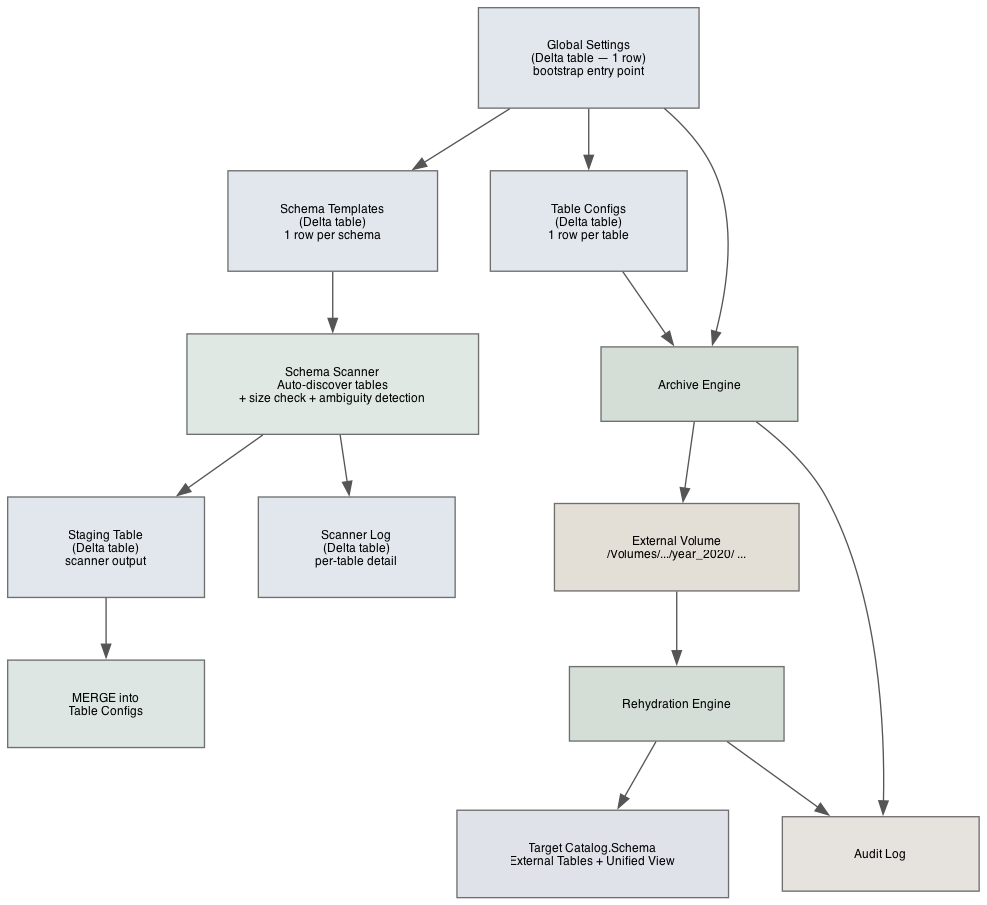

*Source: [`diagrams/01-architecture-overview.dot`](diagrams/01-architecture-overview.dot)*

### How the layers connect

| Layer | What it does | Key location |
|-------|-------------|-----------|
| **Global Settings** | Single-row Delta table — audit location, dry-run default, timezone, archive path prefix, and pointers to other config tables. Bootstrap entry point: job receives this table's full name as a parameter | `{config_catalog}.{config_schema}.global_settings` |
| **Schema Templates** | One row per schema in a Delta table — watermark column patterns, retention defaults, size thresholds, excluded tables. Scanner reads this to discover and onboard tables | `{config_catalog}.{config_schema}.schema_templates` |
| **Table Configs** | One row per table in a Delta table — archive settings including watermark column, retention, exclusion conditions. Archive job reads this as primary input. Supports optional filter expressions for subset processing | `{config_catalog}.{config_schema}.table_configs` |
| **Table Configs Staging** | Same schema as table configs minus audit columns, plus `scan_run_id` and `scan_timestamp`. Scanner writes discovered tables here, then a MERGE reconciles with the main table configs table | `{config_catalog}.{config_schema}.table_configs_staging` |
| **Schema Scanner** | Discovers tables in Unity Catalog, matches watermark columns (with ambiguity detection), checks table sizes, writes to staging Delta table, writes per-table detail to `scanner_log` Delta table, then MERGEs staging into final table configs | `src/scanner.py` |
| **Archive Engine** | Reads config, evaluates conditions, writes year folders to storage | `src/archiver.py` |
| **Cloud Storage** | Stores archived data as self-contained Delta External tables per year within Unity Catalog External Volumes | `/Volumes/{catalog}/{schema}/{volume}/` paths only |
| **Rehydration Engine** | Creates zero-copy external tables from archive folders | `src/rehydrator.py` |
| **Target** | Where rehydrated data appears — any catalog/schema the user chooses | Unity Catalog tables + views |
| **Audit** | Logs every archive and rehydrate action with job context | `src/audit.py` |
| **Exceptions** | Custom exception hierarchy with diagnostic message templates for error classification and fail-forward behavior | `src/exceptions.py` |

---

## 2. Class Architecture

Classes own shared state; pure functions handle stateless logic. Classes receive `spark` as a constructor parameter — the only platform dependency they need. Notebooks are the boundary layer: they obtain `spark` and `dbutils` from the platform, extract values from `dbutils` (job context) into plain dicts via `RunContext`, and pass `spark` + `RunContext` to class constructors. Classes never see `dbutils`. This makes every module unit-testable — mock `spark` in unit tests, use real `spark` on the cluster.

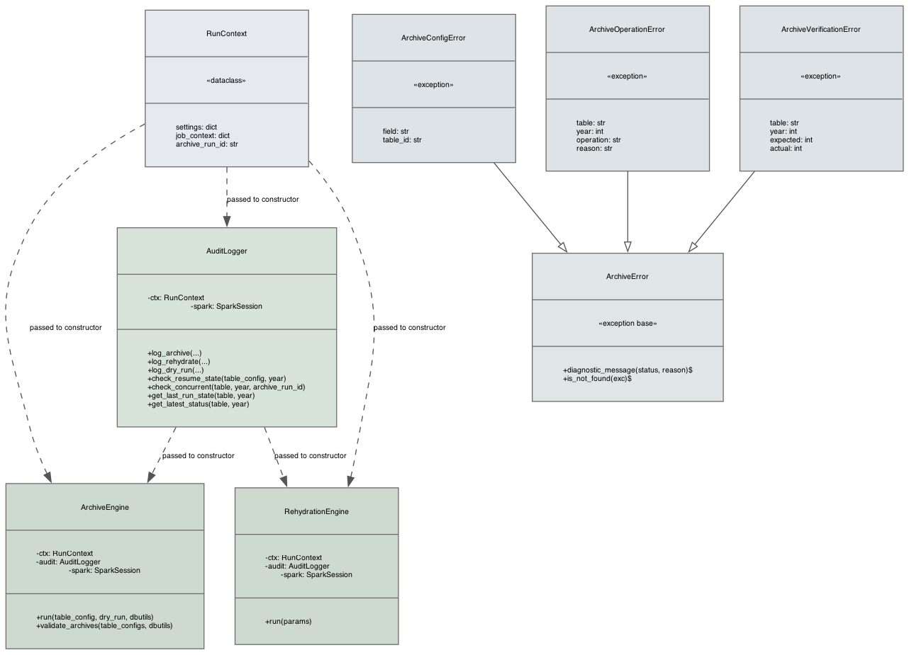

*Source: [`diagrams/02-class-architecture.dot`](diagrams/02-class-architecture.dot)*

| Class | Purpose |
|-------|---------|
| **RunContext** | Immutable bag of runtime state — settings dict (from global_settings table), job metadata dict, and the unique run ID. Built once per notebook invocation and threaded through all constructors. |
| **ArchiveError** | Base exception class. Holds diagnostic message templates (e.g., `concurrent_skip`, `ownership`, `missing_folder_after_delete`) and the `is_not_found()` static helper. |
| **AuditLogger** | Writes every archive/rehydrate outcome to Delta audit tables. Also handles resume detection (pick up after a crash), concurrent-run guards, and watermark tracking. |
| **ArchiveEngine** | Core archive logic: evaluates retention, applies exclusion conditions, writes year folders, verifies counts, and optionally deletes from source. |
| **RehydrationEngine** | Restores archived data on demand — creates zero-copy external tables over archive folders and a unified view combining live + historical data. |
| **ArchiveConfigError** | Raised for invalid configuration (bad operators, missing fields). Stops the job before any data is touched. |
| **ArchiveOperationError** | Raised for runtime failures (storage write errors, Spark exceptions). Fails the current table; other tables continue. |
| **ArchiveVerificationError** | Raised when post-write count verification fails or a concurrent run is detected. Prevents source deletes. |

### What stays as pure functions

| Module | Why no class |
|--------|-------------|
| `src/config.py` | Reads Delta config tables, validates, returns dicts. No shared state. |
| `src/conditions.py` | Translates config dicts to SQL strings. Includes `normalize_condition()` for consistent condition dict format. Stateless. |
| `src/scanner.py` | Reads Unity Catalog metadata, matches watermark columns (with ambiguity detection), checks table sizes, writes scanner_log, writes to staging Delta table, MERGEs to final table configs. Supports targeted scan by `schema_id` or all active templates. Stateless. |
| `src/utils.py` | Path helpers, `get_job_context()`, `generate_archive_run_id()`, `configure_logging()`, SQL quoting helpers, INSERT builders. Standalone. |
| `src/exceptions.py` | Exception class definitions with diagnostic message templates. |

### How RunContext flows

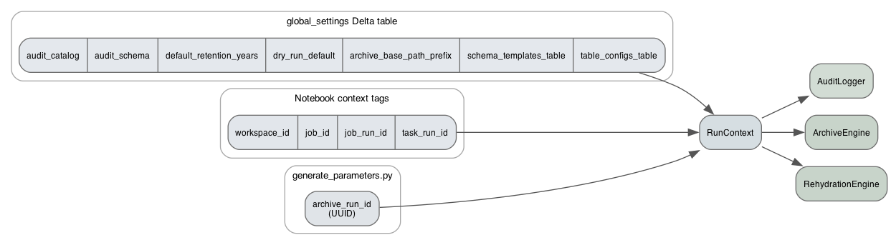

*Source: [`diagrams/03-runcontext-flow.dot`](diagrams/03-runcontext-flow.dot)*

### Notebook wiring

```python
settings = load_settings(spark, config_table)  # reads global_settings Delta table
archive_run_id = generate_archive_run_id()
configure_logging(archive_run_id)
ctx = RunContext(settings, get_job_context(dbutils), archive_run_id)
audit = AuditLogger(ctx, spark)
engine = ArchiveEngine(ctx, audit, spark)
engine.run(table_config, dry_run=dry_run, dbutils=dbutils)
```

`load_settings()` reads the single-row `global_settings` Delta table specified by the `config_table` job parameter. Returns the row as a dict. The table contains pointers (`schema_templates_table`, `table_configs_table`) that the process uses to discover other config tables.

---

## 3. Archive Process Flow

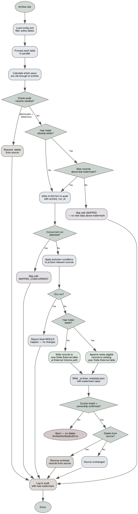

*Source: [`diagrams/04-archive-process-flow.dot`](diagrams/04-archive-process-flow.dot)*

### Incremental archive for existing year folders

When a year folder already exists, the engine uses the watermark recorded in the audit log to determine whether new data exists:

| # | Year folder exists? | New records above watermark? | Behavior |
|---|---|---|---|
| 1 | No | N/A | **CREATE** — write all eligible records as a new Delta External table at the External Volume path |
| 2 | Yes | Yes | **APPEND** — append newly-eligible records to the existing year Delta External table |
| 3 | Yes | No | **SKIP** — no work needed; log `SKIPPED` status |

**No overwrite mode.** Archive folders are append-only by design. If a folder contains incorrect data, the operator manually removes the folder and its audit log entries, then re-runs.

**Why watermark works for both `delete_after_archive` modes:**
- When `delete_after_archive=true`: source has only leftovers (excluded + NULL watermark). Watermark correctly identifies which of those leftovers are newly-eligible
- When `delete_after_archive=false`: source retains all records. Watermark still correctly identifies records not yet archived (their watermark value is higher than `MAX(watermark_column)` from the last audit row)

**Audit logging for appends:** The audit row uses status `ARCHIVED` with `record_count` reflecting only the newly-appended records. The `_archive_metadata.json` includes `"mode": "append"` and the new high-watermark value.

**Rehydration is unaffected.** External tables point to the year folder. Delta reads all transactions — including appends — transparently.

### Stale STARTED detection

When `check_concurrent()` finds a STARTED row from a foreign `archive_run_id`, it compares the row age against `stale_started_threshold_hours` (global settings, default 4.0). If the row is older than the threshold, the current run skips with `SKIPPED_CONCURRENT` and a diagnostic message indicating the stale state.

### `_archive_metadata.json` schema

Written alongside each year folder after a successful archive write. Human-readable provenance — no runtime code reads it.

```json
{
  "archive_run_id": "a1b2c3d4-e5f6-7890-abcd-ef1234567890",
  "source_catalog": "healthcare",
  "source_schema": "claims",
  "source_table": "member",
  "archive_year": 2020,
  "watermark_column": "claim_date",
  "retention_years": 5,
  "record_count": 1250000,
  "null_date_count": 37,
  "conditions_applied": ["active_status", "recent_claims"],
  "delete_after_archive": true,
  "mode": "write",
  "last_watermark_value": "2020-12-31",
  "archived_by": "archive-service-principal",
  "archive_timestamp": "2026-03-30T14:30:22.471Z",
  "workspace_id": "1234567890123456",
  "job_id": "987654321",
  "job_run_id": "11223344",
  "task_run_id": "55667788"
}
```

---

## 4. Rehydration Process Flow

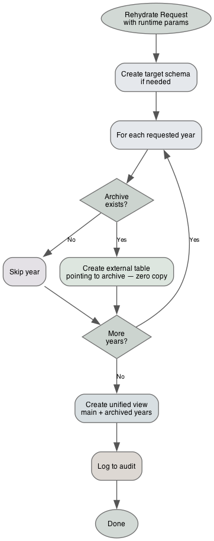

*Source: [`diagrams/05-rehydration-process-flow.dot`](diagrams/05-rehydration-process-flow.dot)*

---

## 5. Exclusion Conditions

Business rules in the config get translated to SQL automatically:

| Condition in Config | Generated SQL |
|--------------------|---------------|
| `status_flag equals Active` | `AND NOT (status_flag = 'Active')` |
| Custom SQL: member has recent claims | `AND NOT (EXISTS (SELECT 1 FROM claims ...))` |

If **either** condition matches, the record stays in the source table.

### Supported operators

| Operator | Example |
|----------|---------|
| `equals` | `status = 'Active'` |
| `not_equals` | `status != 'Closed'` |
| `in` | `status IN ('Active', 'Pending')` |
| `within_years` | `last_update within 2 years of today` |
| `within_months` | `last_activity within 6 months` |
| `greater_than` | `balance > 0` |
| `is_not_null` | `active_flag IS NOT NULL` |

### Condition normalization

`normalize_condition()` in `conditions.py` standardizes condition dicts from various input formats (Spark Row objects, dicts with legacy keys like `scope` → `type`). Both `config.py` (strict validation) and `archiver.py` (tolerant parsing) use this shared normalizer.

---

## 6. Archive Audit Status State Machine

Statuses are enumerated values. `STARTED` enables concurrency detection. `ARCHIVED` enables resumability — if a previous run wrote the archive but crashed before deleting, the next run picks up from there.

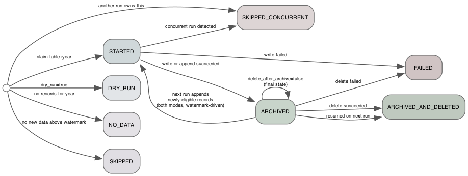

*Source: [`diagrams/06-audit-status-state-machine.dot`](diagrams/06-audit-status-state-machine.dot)*

### Archive statuses

| Status | Meaning |
|--------|---------|
| `STARTED` | Archive in progress for this table+year. Used for concurrency detection — contains `archive_run_id`. Applies to both initial writes and incremental appends |
| `DRY_RUN` | Dry-run completed; report generated, no data touched |
| `ARCHIVED` | Records written to archive storage; source unchanged. For incremental appends, `record_count` reflects only the newly-appended records |
| `ARCHIVED_AND_DELETED` | Records written and deleted from source |
| `FAILED` | Operation failed (error_message has details) |
| `SKIPPED` | Year folder exists but no new records above the last watermark — no work needed for this table+year |
| `SKIPPED_CONCURRENT` | Another job run is already processing this table+year |
| `NO_DATA` | No records found for the year |

### Rehydration statuses

| Status | Meaning |
|--------|---------|
| `COMPLETED` | All requested years restored as external tables |
| `FAILED` | No years restored or hard error (error_message has details) |

---

## 7. Audit Table Schemas

### archive_audit_log

| Column | Type | Description |
|--------|------|-------------|
| `audit_id` | STRING | Unique audit entry ID |
| `archive_run_id` | STRING | Durable correlation key — UUID from `generate_parameters`. Links all audit rows, year folders, and `_archive_metadata.json` from a single job run |
| `table_name` | STRING | Fully qualified source table name |
| `year` | INT | Year partition being archived |
| `status` | STRING | Enumerated (see Section 6) |
| `record_count` | BIGINT | Number of records affected |
| `conditions_applied` | STRING | JSON payload of exclusion conditions and counts |
| `null_date_count` | BIGINT | Records with NULL in the watermark column |
| `error_message` | STRING | Error details when status is FAILED |
| `watermark_value` | DATE | `MAX(watermark_column)` at the time of the archive write or append. Used by the next run to detect new records |
| `source_year_count` | BIGINT | `COUNT(*)` from source for this year at time of run |
| `archive_mode` | STRING | How the write was performed: `CREATE` / `APPEND` / `SKIP` |
| `archived_by` | STRING | `current_user()` |
| `workspace_id` | STRING | Databricks workspace ID |
| `job_id` | STRING | Job ID from job context |
| `job_run_id` | STRING | Job run ID from job context |
| `task_run_id` | STRING | Task run ID from job context |
| `created_at` | TIMESTAMP | When this audit entry was created |

### rehydration_audit_log

| Column | Type | Description |
|--------|------|-------------|
| `audit_id` | STRING | Unique audit entry ID |
| `archive_run_id` | STRING | UUID or NULL (rehydration may be ad-hoc) |
| `archive_path` | STRING | Archive storage path being rehydrated |
| `source_table` | STRING | Original source table name |
| `target_catalog` | STRING | Destination catalog for rehydrated tables |
| `target_schema` | STRING | Destination schema for rehydrated tables |
| `years` | STRING | Comma-separated list of years rehydrated |
| `tables_created` | INT | Number of external tables created |
| `status` | STRING | `COMPLETED` / `FAILED` |
| `error_message` | STRING | Error details when status is FAILED |
| `rehydrated_by` | STRING | `current_user()` |
| `workspace_id` | STRING | Databricks workspace ID |
| `job_id` | STRING | Job ID from job context |
| `job_run_id` | STRING | Job run ID from job context |
| `task_run_id` | STRING | Task run ID from job context |
| `created_at` | TIMESTAMP | When this audit entry was created |

---

## 8. Data Flow: End to End

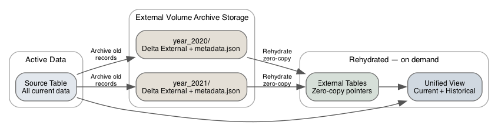

*Source: [`diagrams/07-data-flow-e2e.dot`](diagrams/07-data-flow-e2e.dot)*

---

## 9. Schema Scanner Flow

Two-stage scan: the scanner writes discovered tables to a staging Delta table (`table_configs_staging`), then a MERGE reconciles staging against the main `table_configs` table to detect manual edits, new tables, and dropped tables.

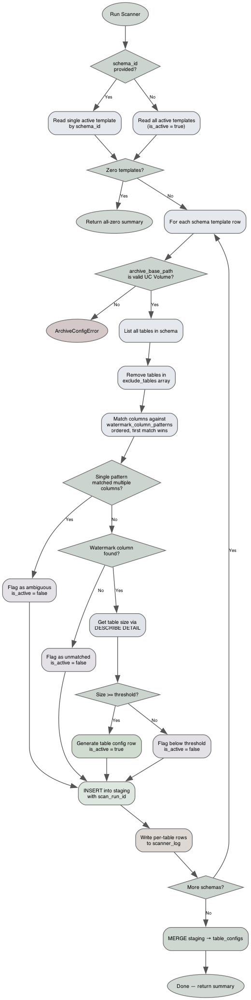

*Source: [`diagrams/08-scanner-flow.dot`](diagrams/08-scanner-flow.dot)*

### Archive path validation

Before scanning tables for a schema, the scanner validates that `archive_base_path` is a Unity Catalog External Volume path (`/Volumes/` prefix) and that the specified volume exists. Direct cloud storage paths (`s3://`, `abfss://`) are rejected.

### MERGE logic

Manual edit detection via `modified_by` column. Rows where `modified_by = 'scanner'` are scanner-managed and will be updated. Rows where `modified_by` is anything else were manually edited and are preserved.

| Scenario | Behavior |
|---|---|
| Table in staging, not in table_configs | INSERT as new row, `modified_by = 'scanner'` |
| Table in both, `modified_by = 'scanner'` | UPDATE from staging (re-evaluated size, watermark column) |
| Table in both, `modified_by != 'scanner'` | Preserve — manual edits are not overwritten |
| Table in table_configs only, `modified_by = 'scanner'` | Set `is_active = false`, reason notes the scan timestamp |
| Table in table_configs only, `modified_by != 'scanner'` | Preserve unchanged — manually managed tables are not dropped |

### Ambiguous watermark column handling

When a single pattern matches more than one column in a table, the scanner flags the table as ambiguous rather than guessing:

| Match result | `is_active` | Example |
|---|---|---|
| Exactly one column matches a pattern | `true` | `claim_date` matches `"claim_date"` |
| Multiple columns match the same pattern | `false` | Catch-all regex hits 3 columns |
| No pattern matches any column | `false` | Table has no date-like columns |

**Resolution:** The operator adds a specific exact-name pattern earlier in the `watermark_column_patterns` array (e.g., `"start_date"` before `".*_date$"`), or manually sets `watermark_column` in the table config row (preserved by MERGE logic since `modified_by` will differ from `'scanner'`).

### Scanner log table (`scanner_log`)

Every scanner run writes per-table detail rows to a Delta table — separate from the archive audit tables. This is a diagnostic/analysis table: no runtime code reads it.

| Column | Type | Description |
|--------|------|-------------|
| `log_id` | STRING | Unique log entry ID |
| `scan_run_id` | STRING | UUID generated per scanner invocation |
| `table_id` | STRING | Logical ID: `catalog.schema.table` |
| `source_catalog` | STRING | Unity Catalog catalog name |
| `source_schema` | STRING | Unity Catalog schema name |
| `source_table` | STRING | Discovered table |
| `match_status` | STRING | `matched` / `ambiguous` / `unmatched` / `excluded` |
| `matched_column` | STRING | Resolved watermark column, or NULL |
| `matched_pattern` | STRING | Pattern that produced the match, or NULL |
| `all_matched_columns` | STRING | JSON array of all columns matched by the pattern |
| `ambiguity_detail` | STRING | Detail when match_status is `ambiguous`, or NULL |
| `table_size_gb` | DOUBLE | From `DESCRIBE DETAIL`, or NULL if unavailable |
| `size_check_passed` | BOOLEAN | Whether table passed `min_table_size_gb` threshold |
| `is_active` | BOOLEAN | Whether the scanner marked this table active |
| `inactive_reason` | STRING | Reason when `is_active = false`, or NULL |
| `merge_action` | STRING | `added` / `updated` / `preserved` |
| `workspace_id` | STRING | Databricks workspace ID |
| `scanned_by` | STRING | `current_user()` |
| `created_at` | TIMESTAMP | When this log entry was created |

---

## 10. Configuration — Delta Tables

All configuration is stored in Delta tables within the target environment's Unity Catalog. There are no JSON config files and no environment overlay mechanism. Each workspace has its own config tables with the correct values for that environment.

### Bootstrap flow

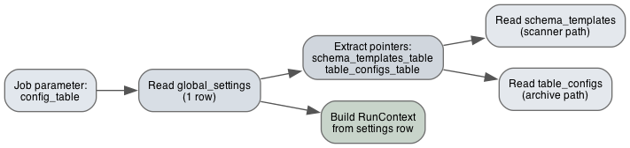

*Source: [`diagrams/09-bootstrap-flow.dot`](diagrams/09-bootstrap-flow.dot)*

The job receives one parameter: `config_table` — the full three-level name of the `global_settings` Delta table (e.g., `archive_config.config.global_settings`). That single-row table contains pointers to all other config tables. The config table location IS the environment — no overlay or merge logic needed.

### Config table schemas

See `notebooks/setup_config_tables.py` for full CREATE TABLE statements.

#### `global_settings` (1 row — bootstrap entry point)

| Column | Type | Description |
|--------|------|-------------|
| `audit_catalog` | STRING NOT NULL | Unity Catalog for audit tables |
| `audit_schema` | STRING NOT NULL | Schema for audit tables |
| `default_retention_years` | INT NOT NULL | Default retention when table config omits it |
| `dry_run_default` | BOOLEAN NOT NULL | Default dry-run flag |
| `timezone` | STRING NOT NULL | Spark session timezone for date comparisons |
| `schema_templates_table` | STRING NOT NULL | Pointer: full 3-level name of schema_templates table |
| `table_configs_table` | STRING NOT NULL | Pointer: full 3-level name of table_configs table |
| `archive_base_path_prefix` | STRING NOT NULL | Cloud storage prefix for this environment |
| `modified_by` | STRING NOT NULL | Who last changed this row |
| `modified_at` | TIMESTAMP NOT NULL | When last changed |
| `change_reason` | STRING | Why it was changed |

Optional runtime setting: `stale_started_threshold_hours` (default 4.0) — controls how long a `STARTED` audit row from another run must be before the current run treats it as stale during concurrency detection.

#### `schema_templates` (1 row per schema)

| Column | Type | Description |
|--------|------|-------------|
| `schema_id` | STRING NOT NULL PK | Human-readable identifier (e.g. `claims`, `members`) |
| `source_catalog` | STRING NOT NULL | Unique with `source_schema` (enforced in code) |
| `source_schema` | STRING NOT NULL | Unique with `source_catalog` (enforced in code) |
| `watermark_column_patterns` | ARRAY&lt;STRING&gt; NOT NULL | Ordered list of regex patterns for watermark column matching |
| `default_retention_years` | INT NOT NULL | Default retention for tables in this schema |
| `archive_base_path` | STRING NOT NULL | Base archive path — must be a UC External Volume path (`/Volumes/...`) |
| `delete_after_archive` | BOOLEAN NOT NULL | Default delete behavior |
| `min_table_size_gb` | DOUBLE NOT NULL | Minimum size threshold (0 = no filtering) |
| `exclude_tables` | ARRAY&lt;STRING&gt; | Table names to skip during scanning |
| `description` | STRING | Human-readable description |
| `is_active` | BOOLEAN NOT NULL | Whether to include in scanner runs |
| `modified_by` | STRING NOT NULL | Audit |
| `modified_at` | TIMESTAMP NOT NULL | Audit |
| `change_reason` | STRING | Audit |

#### `table_configs` (1 row per table)

| Column | Type | Description |
|--------|------|-------------|
| `table_id` | STRING NOT NULL PK | `"catalog.schema.table"` |
| `source_catalog` | STRING NOT NULL | Unity Catalog catalog |
| `source_schema` | STRING NOT NULL | Unity Catalog schema |
| `source_table` | STRING NOT NULL | Table name |
| `watermark_column` | STRING | Resolved watermark column for retention (NULL if unmatched/ambiguous) |
| `retention_years` | INT | NULL = inherit from `global_settings.default_retention_years` |
| `archive_base_path` | STRING NOT NULL | Full archive path — must be a UC External Volume path |
| `delete_after_archive` | BOOLEAN NOT NULL | Whether to delete after successful archive |
| `is_active` | BOOLEAN NOT NULL | Include in archive runs |
| `reason` | STRING | Why inactive (scanner or manual) |
| `exclusion_conditions` | ARRAY&lt;STRUCT&lt;name, scope, column, operator, value, sql&gt;&gt; | Business rules — see Section 5 |
| `modified_by` | STRING NOT NULL | Audit — `'scanner'` for auto-managed rows |
| `modified_at` | TIMESTAMP NOT NULL | Audit |
| `change_reason` | STRING | Audit |
| `scan_run_id` | STRING | UUID of the scanner run that last inserted or updated this row |

#### `table_configs_staging` (scanner output)

Same schema as `table_configs` minus audit columns (`modified_by`, `modified_at`, `change_reason`), plus `scan_run_id STRING NOT NULL` and `scan_timestamp TIMESTAMP NOT NULL`. Scanner writes here; MERGE reconciles with `table_configs`.

### Setup and seed — separate jobs

DABs does not support declarative table creation, so setup is handled by two separate notebook jobs:

| Job | Notebook | Purpose |
|-----|----------|---------|
| `setup_config_tables` | `notebooks/setup_config_tables.py` | Creates all Delta tables (config + audit). Idempotent — uses `CREATE TABLE IF NOT EXISTS`. Run once per environment |
| `seed_config` | `notebooks/seed_config.py` | Inserts sample config rows (global_settings + schema_templates). Run after setup to populate initial values |

### Change tracking

Two layers:

- **Audit columns**: Every config table has `modified_by`, `modified_at`, `change_reason`. Tracks who changed what and why.
- **Delta time travel**: Built-in versioned history. Query any previous state via `VERSION AS OF` or `TIMESTAMP AS OF`. Provides rollback capability.

### Service principal per environment

In QA, Stage, and Prod, jobs run as a service principal configured via `run_as` in the DABs target. Dev runs as the user's identity for interactive testing.

### M2M OAuth for CI/CD deployment

CI/CD pipelines authenticate to higher-environment workspaces using OAuth M2M. The service principal's `client_id` and `client_secret` are stored in CI pipeline secrets (e.g., GitHub Actions secrets, Azure DevOps variable groups) — never in the repository.

```yaml
# In databricks.yml (DABs bundle)
targets:
  dev-serverless:
    default: true
    # No run_as — runs as deploying user

  qa:
    mode: production
    workspace:
      host: https://qa.cloud.databricks.com
    run_as:
      service_principal_name: "archive-service-principal"

  prod:
    mode: production
    workspace:
      host: https://prod.cloud.databricks.com
    run_as:
      service_principal_name: "archive-service-principal"
```

The SP needs these Unity Catalog grants (provisioned outside this project):

| Permission | On what | Why |
|-----------|---------|-----|
| `USE CATALOG`, `USE SCHEMA` | Source catalogs/schemas | Read source tables |
| `SELECT`, `MODIFY` | Source tables | Read records, delete archived records |
| `USE CATALOG`, `USE SCHEMA`, `CREATE TABLE` | Audit catalog/schema | Write audit logs |
| `SELECT` | Config catalog/schema | Read config Delta tables |
| `MODIFY` | Config tables (scanner only) | Scanner writes to staging and merges to table_configs |
| `WRITE FILES` | Archive storage paths | Write year folders |
| `CREATE TABLE`, `CREATE VIEW` | Rehydration target catalogs | Create external tables and unified views |

`current_user()` returns the SP application ID when running as SP, or user email when interactive — both are stored in `archived_by` / `rehydrated_by` with no code changes needed.

---

## 11. CI/CD Pipeline

Three stages. Unit tests run without Databricks (fast, free). Config validation happens at runtime against Delta tables (schema enforced by Delta's type system). Same bundle promotes through environments. Higher-environment deploys authenticate via M2M OAuth.

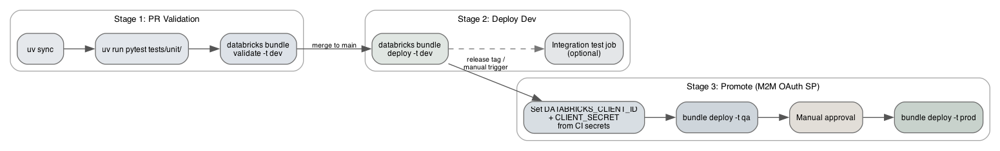

*Source: [`diagrams/10-cicd-pipeline.dot`](diagrams/10-cicd-pipeline.dot)*

---

## 12. Application Logging

Standard Python `logging` module — separate from audit tables. Audit captures outcomes; logging captures diagnostic detail for troubleshooting.

### Logger hierarchy

| Logger name | Module | Used for |
|------------|--------|----------|
| `caresource_archive.config` | `src/config.py` | Config table reads, validation results |
| `caresource_archive.conditions` | `src/conditions.py` | Generated SQL fragments |
| `caresource_archive.archiver` | `src/archiver.py` | Year processing, skip reasons, counts |
| `caresource_archive.rehydrator` | `src/rehydrator.py` | External table creation, view creation |
| `caresource_archive.audit` | `src/audit.py` | Audit writes, resume state checks |
| `caresource_archive.scanner` | `src/scanner.py` | Table discovery, pattern matching, ambiguity detection, scanner_log writes |

### Log format

```
[{timestamp}] [{level}] [{archive_run_id}] [{table}] {message}
```

### Log levels

| Level | When to use | Example |
|-------|------------|---------|
| `DEBUG` | SQL generation, config merge steps, path calculations | `Generated WHERE clause: AND NOT (status = 'Active')` |
| `INFO` | Table/year being processed, skip reasons, completion | `Archiving year 2020 for healthcare.claims.member` |
| `WARNING` | Empty custom_sql results, unusual counts | `custom_sql condition 'recent_claims' returned 0 exclusions` |
| `ERROR` | NULL watermark records (required value missing), operation failures | `1,200 records with NULL claim_date — excluded from archiving` |

On Databricks, Python logs go to the driver log — visible in the job run output. If `system.compute.driver_logs` is enabled on the workspace, logs are queryable via SQL.

---

## 13. Error Handling Pattern

Each ForEach task wraps its work with a consistent try/except pattern:

```python
try:
    engine.run(table_config, dry_run=dry_run, dbutils=dbutils)
except ArchiveConfigError:
    raise  # should not happen in ForEach (caught in generate_parameters)
except (ArchiveOperationError, ArchiveVerificationError) as e:
    audit.log_archive(table, year, status="FAILED", error_message=str(e))
    raise  # DABs marks this task failed, other tasks continue
```

### Diagnostic messages

`ArchiveError.diagnostic_message(status, reason, **kwargs)` produces structured error messages using templates for common failure scenarios. Templates include actionable SQL queries for the operator. The method never raises — it falls back to a generic message if template substitution fails.

---

## 14. Rollback and Recovery

No separate rollback mechanism. Safety is layered:

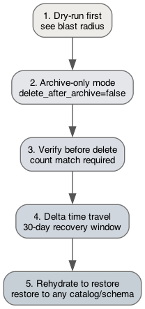

*Source: [`diagrams/11-rollback-recovery.dot`](diagrams/11-rollback-recovery.dot)*

| Layer | What it does | When to use |
|-------|------------|-------------|
| Dry-run | See what would happen without touching data | Before every production run |
| Archive-only | Archive without deleting — data exists in both places | First few cycles for new tables |
| Verify-before-delete | Abort delete if counts don't match | Every delete (automatic) |
| Delta time travel | `VERSION AS OF` recovers deleted records | Emergency — within 30 days of delete |
| Rehydrate | Restore archived data to any location | When historical data is needed again |

---

## 15. Testing Strategy — Requirements First

Tests are written **before** implementation code, derived from the requirements document (not from the implementation).

### Per-module workflow

```
1. Read requirements → 2. Write tests → 3. Tests fail → 4. Write code → 5. Tests pass
```

### Test categories

| Category | Tests From | Unit (mocked) | Integration (cluster) | Example |
|----------|-----------|:---:|:---:|---------|
| Config validation | CFG-01 through CFG-09 | Yes | — | Invalid operator rejected; Delta table read and validation |
| Condition SQL | EXC-01 through EXC-05 | Yes | — | `within_years` generates correct date comparison |
| Exceptions | ERR-01 through ERR-04 | Yes | — | Exception hierarchy, diagnostic message templates |
| Utils | — | Yes | — | Path helpers, ID generation, logging config |
| Scanner logic | SCN-01 through SCN-13 | Yes | Yes | Pattern matching, size threshold, merge/diff logic |
| Archive engine | ARC-01 through ARC-11, DRY-01 through DRY-05, CONC-01 through CONC-04 | Yes | Yes | Resume deletes, concurrency, NULL watermark handling |
| Rehydration | RHY-01 through RHY-06 | Yes | Yes | External table creation SQL, view SQL |
| Audit logging | AUD-01 through AUD-08 | Yes | Yes | Status transitions, archive_run_id, watermark tracking |
| Application logging | LOG-01 through LOG-05 | Yes | — | Logger hierarchy, structured format includes run_id |

---

## 16. Project Structure

```
CareSourceArchive/
├── pyproject.toml                # Package metadata, build config, pytest config
├── .python-version               # Pin Python version for local dev and CI
├── databricks.yml                # DABs bundle: targets (dev-serverless, dev, qa, stage, prod)
├── src/
│   ├── __init__.py
│   ├── exceptions.py             # ArchiveError base + ArchiveConfigError, ArchiveOperationError, ArchiveVerificationError
│   ├── config.py                 # Pure functions: read Delta config tables, validate, return dicts
│   ├── conditions.py             # Pure functions: build SQL WHERE clauses + normalize_condition
│   ├── scanner.py                # Pure functions: scan UC, write staging, MERGE to table_configs
│   ├── archiver.py               # ArchiveEngine class: archive + dry-run + validate_archives
│   ├── rehydrator.py             # RehydrationEngine class: external tables + views
│   ├── audit.py                  # AuditLogger class: all audit logging + concurrency + watermark
│   └── utils.py                  # RunContext dataclass + helpers + SQL quoting + configure_logging()
├── notebooks/
│   ├── setup_config_tables.py    # One-time: create all Delta tables (config + audit)
│   ├── seed_config.py            # Seed config rows (global_settings + schema_templates)
│   ├── generate_parameters.py    # Config → ForEach task values + archive_run_id
│   ├── run_archive.py            # Thin wrapper → ArchiveEngine
│   ├── run_rehydrate.py          # Thin wrapper → RehydrationEngine
│   └── run_scanner.py            # Thin wrapper → scanner functions
├── tests/
│   ├── conftest.py               # Shared fixtures: mock_spark, mock_run_context, mock_audit
│   └── unit/                     # Runs locally with uv run pytest — mocked spark
│       ├── test_exceptions.py
│       ├── test_utils.py
│       ├── test_config.py
│       ├── test_conditions.py
│       ├── test_scanner.py
│       ├── test_archiver.py
│       ├── test_rehydrator.py
│       └── test_audit.py
├── resources/
│   ├── archive_job.yml           # DABs: generate_parameters → ForEach run_archive
│   ├── scanner_job.yml           # DABs: run_scanner
│   ├── setup_job.yml             # DABs: create config Delta tables
│   ├── seed_config_job.yml       # DABs: seed sample config rows
│   └── generate_test_data_job.yml # DABs: generate test source data (dev only)
└── docs/
    ├── diagrams/                 # Graphviz .dot sources + PNG renders (figures in design.md)
    ├── requirements.md
    ├── requirements-summary.md
    ├── design.md
    ├── features.md
    ├── tracker.md
    ├── decisions.md
    ├── development-rules.md
    ├── prerequisites.md
    └── runbooks/
```

### Config Delta tables (in Unity Catalog, per environment)

```
{config_catalog}.{config_schema}/
├── global_settings              # 1 row — bootstrap entry, pointers to other tables
├── schema_templates             # 1 row per schema — scanner input
├── table_configs                # 1 row per table — archive job input
├── table_configs_staging        # Scanner output — MERGE reconciles with table_configs
├── scanner_log                  # Per-table-per-scan diagnostic rows
├── archive_audit_log            # Per-table-per-year-per-run archive outcomes
└── rehydration_audit_log        # Per-rehydration-request outcomes
```
