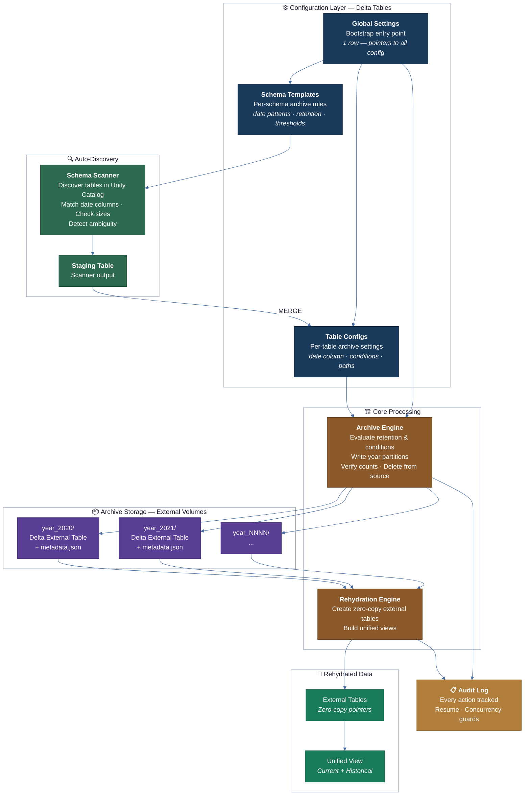
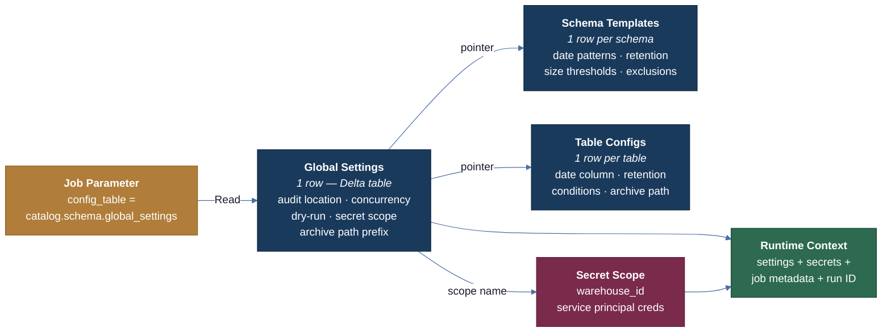
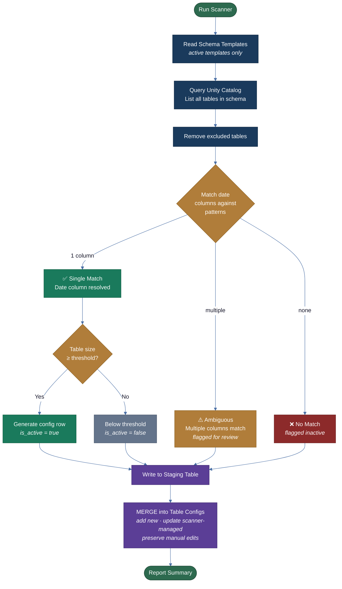
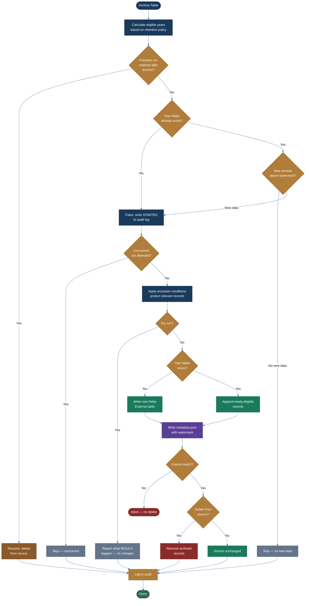
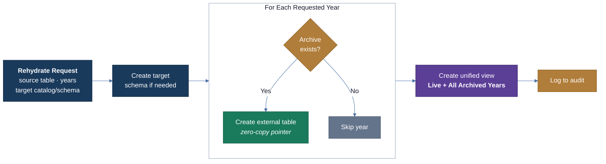
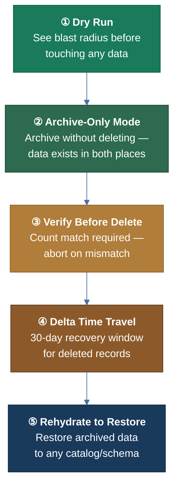
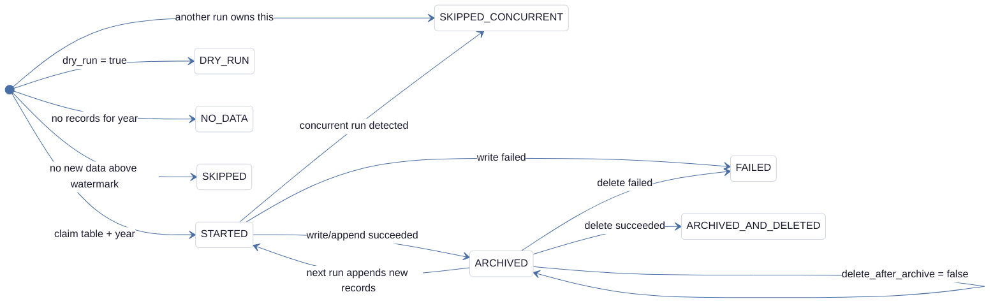
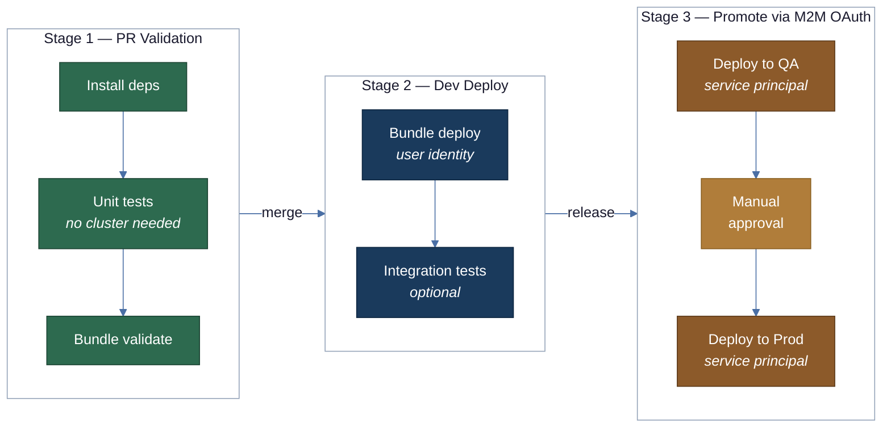
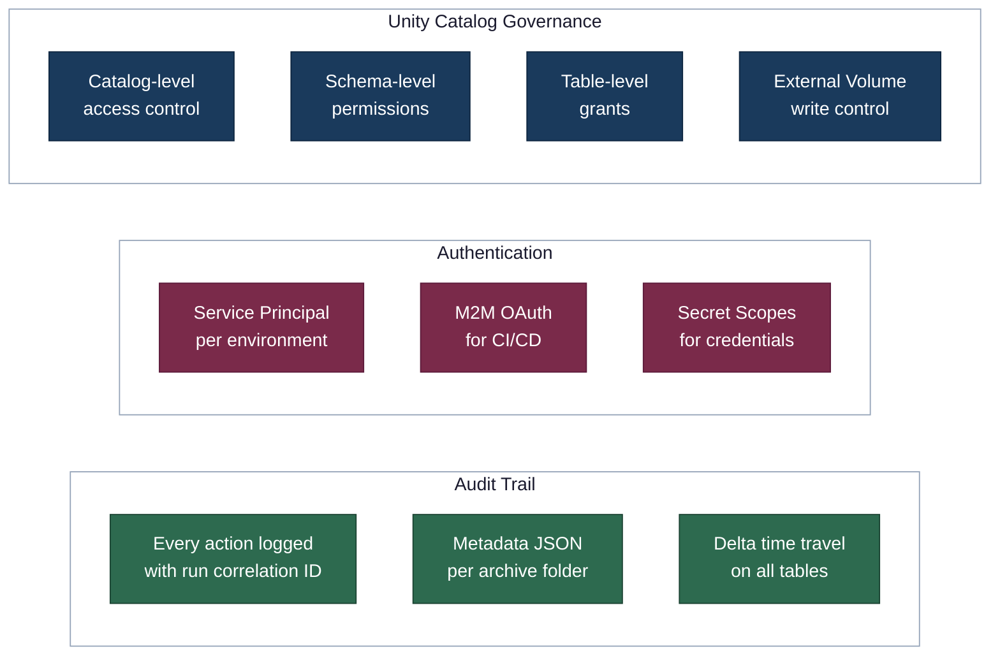

# CareSource Delta Table Archive — High-Level Architecture

## Solution Overview

The CareSource Delta Table Archive is a configuration-driven framework for systematically archiving aged data from Unity Catalog Delta tables into cost-effective external storage, with on-demand rehydration when historical data is needed again.

All configuration lives in Delta tables — no JSON files, no code changes between environments. Each workspace has its own config tables with environment-specific values, and a single job parameter bootstraps the entire process.

---

## 1. System Architecture

---

## 2. End-to-End Data Flow

```mermaid
%%{init: {'theme': 'base', 'themeVariables': {
  'primaryColor': '#ffffff',
  'primaryTextColor': '#1a1a2e',
  'primaryBorderColor': '#d0d5dd',
  'lineColor': '#4a6fa5',
  'secondaryColor': '#ffffff',
  'tertiaryColor': '#ffffff',
  'fontFamily': 'Segoe UI, Roboto, sans-serif'
}}}%%

graph LR
    subgraph ACTIVE["Active Data — Unity Catalog"]
        SRC["<b>Source Tables</b><br/>All current data<br/>healthcare.claims.*<br/>healthcare.members.*"]
    end

    subgraph PROCESS["Archive Processing"]
        direction TB
        EVAL["Evaluate<br/>Retention Rules"]
        COND["Apply Exclusion<br/>Conditions"]
        WRITE["Write to<br/>External Volume"]
        VERIFY["Verify Counts<br/>& Ownership"]
        DEL["Delete from<br/>Source"]
        EVAL --> COND --> WRITE --> VERIFY --> DEL
    end

    subgraph VOL["External Volume Storage"]
        A20["year_2020/"]
        A21["year_2021/"]
        A22["year_2022/"]
    end

    subgraph REHYD["On-Demand Rehydration"]
        EXT["External Tables<br/><i>Zero-copy</i>"]
        UV["Unified View<br/><i>Live + Historical</i>"]
        EXT --> UV
    end

    SRC -->|"Aged records"| EVAL
    DEL -->|"Archive files"| A20 & A21 & A22
    A20 & A21 & A22 -->|"Rehydrate"| EXT
    SRC -->|"Live data"| UV

    style ACTIVE fill:#ffffff,stroke:#94a3b8,color:#1a1a2e
    style PROCESS fill:#ffffff,stroke:#94a3b8,color:#1a1a2e
    style VOL fill:#ffffff,stroke:#94a3b8,color:#1a1a2e
    style REHYD fill:#ffffff,stroke:#94a3b8,color:#1a1a2e

    style SRC fill:#1a3a5c,stroke:#0d253f,color:#ffffff
    style EVAL fill:#8c5a2a,stroke:#5c3a1a,color:#ffffff
    style COND fill:#8c5a2a,stroke:#5c3a1a,color:#ffffff
    style WRITE fill:#8c5a2a,stroke:#5c3a1a,color:#ffffff
    style VERIFY fill:#8c5a2a,stroke:#5c3a1a,color:#ffffff
    style DEL fill:#8c5a2a,stroke:#5c3a1a,color:#ffffff
    style A20 fill:#5b3e96,stroke:#3d2670,color:#ffffff
    style A21 fill:#5b3e96,stroke:#3d2670,color:#ffffff
    style A22 fill:#5b3e96,stroke:#3d2670,color:#ffffff
    style EXT fill:#1a7a5c,stroke:#0d5c3f,color:#ffffff
    style UV fill:#1a7a5c,stroke:#0d5c3f,color:#ffffff
```

---

## 3. Configuration Bootstrap

A single job parameter (`config_table`) bootstraps the entire system. The global settings table contains pointers to all other configuration — no environment overlays, no JSON files.

---

## 4. Schema Scanner — Auto-Discovery

The scanner automatically discovers tables in Unity Catalog, matches date columns using configurable patterns, evaluates table sizes, and onboards tables into the archive configuration — eliminating manual table-by-table setup.

---

## 5. Archive Process — Per Table

Each table is processed independently (parallel via Lakeflow ForEach). The engine supports resumability, concurrency guards, incremental appends, dry-run mode, and count verification before any deletes.

---

## 6. Rehydration — On-Demand Restore

Rehydration creates zero-copy external tables over archive folders and a unified view combining live and historical data. No data is copied — external tables point directly to archive storage.

---

## 7. Safety & Rollback Layers

No separate rollback mechanism is needed. Safety is built into the process at every layer.

| Layer | Purpose | When to Use |
|-------|---------|-------------|
| **Dry Run** | Preview archive impact with zero data changes | Before every production run |
| **Archive-Only** | Write archive but keep source data intact | First few cycles for new tables |
| **Verify Before Delete** | Abort delete if archived count ≠ source count | Every delete (automatic) |
| **Delta Time Travel** | Recover deleted records via `VERSION AS OF` | Emergency — within 30 days |
| **Rehydrate** | Restore archived data to any location | When historical data is needed again |

---

## 8. Audit & Observability

Every archive and rehydration action is logged to Delta audit tables with a durable correlation key (`archive_run_id`) that links all artifacts from a single job run.

| Status | Meaning |
|--------|---------|
| **STARTED** | Archive in progress — used for concurrency detection |
| **DRY_RUN** | Preview completed, no data touched |
| **ARCHIVED** | Records written to archive storage |
| **ARCHIVED_AND_DELETED** | Records archived and removed from source |
| **SKIPPED** | No new data above watermark |
| **SKIPPED_CONCURRENT** | Another run already processing this table |
| **FAILED** | Operation failed — error details in audit log |
| **NO_DATA** | No records found for the year |

---

## 9. CI/CD & Multi-Environment Deployment

Same code promotes through all environments via Databricks Asset Bundles (DABs). Each environment has its own config Delta tables, secret scope, and service principal.

| Environment | Identity | Config Source | Secrets |
|-------------|----------|---------------|---------|
| **Dev** | User identity | `dev_config.config.global_settings` | `archive-dev` scope |
| **QA** | Service principal | `qa_config.config.global_settings` | `archive-qa` scope |
| **Stage** | Service principal | `stage_config.config.global_settings` | `archive-stage` scope |
| **Prod** | Service principal | `prod_config.config.global_settings` | `archive-prod` scope |

---

## 10. Security & Governance

---

## Key Design Decisions

| Decision | Rationale |
|----------|-----------|
| **Config in Delta tables** (not JSON) | Schema enforcement, time travel, audit columns, no environment overlay complexity |
| **External Volumes** (not direct cloud paths) | Unity Catalog governed, portable across clouds, discoverable |
| **Year-based partitioning** | Natural boundary for retention policies, simple to reason about |
| **Append-only archives** | Delta handles incremental writes natively; no overwrite footgun |
| **Watermark-based incrementals** | Works correctly whether source deletes are enabled or not |
| **Zero-copy rehydration** | External tables point to archive storage — no data duplication |
| **Durable `archive_run_id`** | Survives after Lakeflow job history ages out of system tables |
| **Scanner with manual-edit preservation** | Auto-discovery for scale, manual overrides preserved across re-scans |
